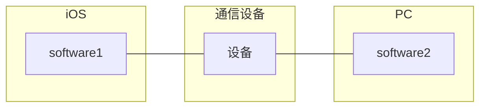

# 计算机网络

计算机网络是一个将分散的，具有独立功能的`计算机系统`，通过`通信设备`与`线路`连接起来，由完善的`软件`实现`资源共享`和`信息传递`的系统。



计算机网络是一个`互连`的，`自治`的计算机集合。

## 计算机网络的组成

组成部分

```
硬件，软件，协议
```

工作方式

```
边缘部分：用户可以指直接使用(C/S方式，P2P方式)

核心部分：为边缘部分服务
```

功能组成

```
通信子网：实现数据通信

资源子网：实现数据共享/数据处理
```

## 计算机网络的分类

#### 按分布范围分

```
广域网WAN

城域网MAN

局域网LAN

个人区域网PAN
```

#### 按使用者分

```
公用网：电信，移动...

专用网：军队，政府...
```

#### 按交换技术分

```
电路交换

报文交换

分组交换
```

#### 按拓扑结构分

```
总线型

星型

环型

网状型
```

#### 按传输技术分

```
广播式网络

点对点网络
```

## 标准化工作

#### 国际标准化组织ISO

```
OSI参考模型，HDLC协议
```

#### 国际电信联盟ITU

```
制定通信规则
```

#### 国际电气电子工程师协会IEEE

```
学术机构
```

#### Internet工程任务组IETF

```
负责因特网相关标准的制定
```

## 计算机网络的性能指标

### 速率

速率即数据率，数据传输率，比特率。

### 带宽

<++>


