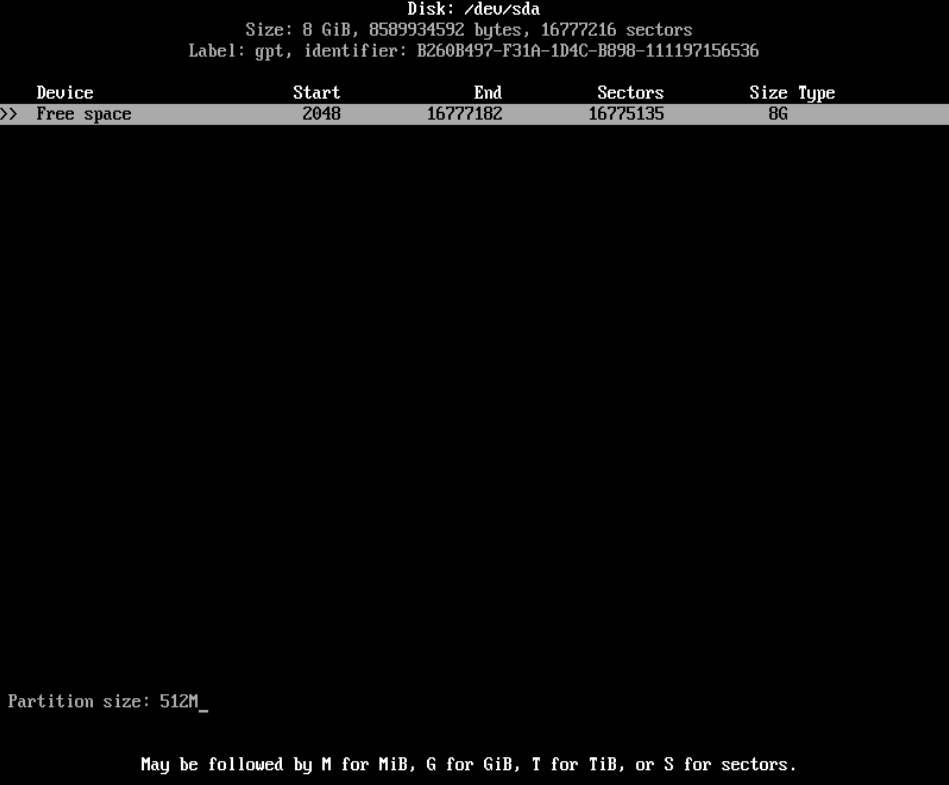
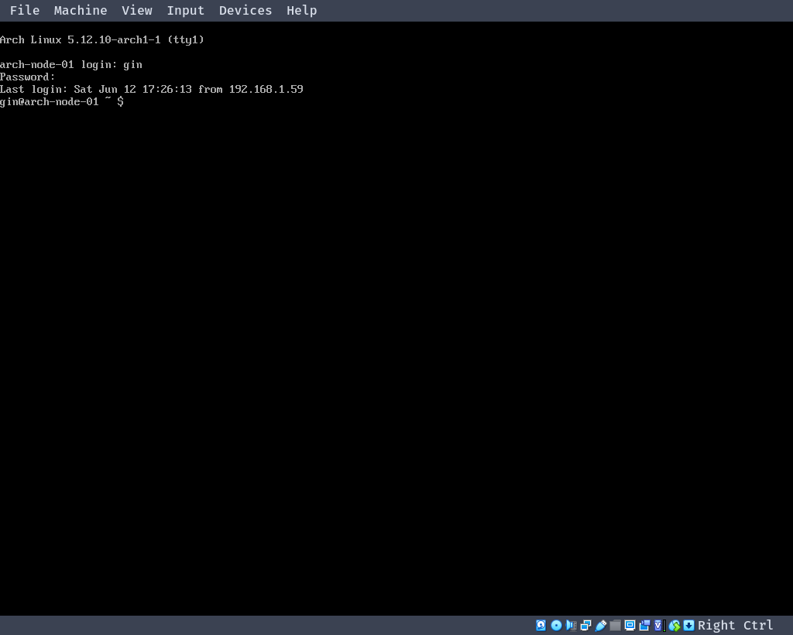

# Arch Linux

`Arch Linux`官方安装向导：https://wiki.archlinux.org/index.php/Installation_guide

[TOC]

## 1. 下载镜像

官方镜像下载地址：https://archlinux.org/download/

## 2. VirtualBox 打开 EFI

勾选`Enable EFI`可以在`VirtualBox`中打开`EFI`。


## 3. 安装 Arch Linux

### 验证启动方式

---

使用以下命令可以验证启动方式是`UEFI`还是`BIOS`。

```sh
ls /sys/firmware/efi/efivars
```

如果命令没有报错，则使用的是`UEFI`。

如果目录不存在则可能使用的是`BIOS`。

### 连接互联网

---

安装`Arch Linux`必须连通网络。

可以插入`网线`或使用`wifi`。

如果使用`虚拟机`，则不需要进行这一步操作。

#### 连接 wifi

---

使用`iwd`连接`wifi`。

```sh
# 进入iwd交互界面
iwctl

# 查看设备名
device list

# 扫描网络
station <设备名> sacn

# 查看网络名称
station <设备名> get-networks

# 连接网络
station <设备名> connent <网络名称>
```

### 更新系统时钟

---

```sh
timedatectl set-ntp true
```

### 磁盘分区

---

可以使用`fdisk`命令进行磁盘分区，也可以使用`cfdisk`命令进行磁盘分区。

`cfdisk`命令拥有交互界面。

```sh
cfdisk
```

输入命令进入`cfdisk`界面。


`BIOS`选择`dos`，`UEFI`选择`gpt`。


`New`创建一个新分区，并输入分区大小。



`Type`选择分区类型。


`boot分区`选择`EFI System`，`swap分区`选择`Linux swap`，`系统分区`选择`Linux filesystem`。


分区完成，`Write`写入磁盘。


#### BIOS 磁盘分区

---

`BIOS`只需要分`2个区`，`swap分区`和`系统分区`。

**分区大小：**

`swap分区`：自定义

`系统分区`：剩余大小

**分区类型：**

| 挂载点 | 分区类型             |
|--------|----------------------|
| swap   | Linux swap(交换分区) |
| /mnt   | Linux(系统分区)      |


#### UEFI 磁盘分区

---

`UEFI`需要创建`3个分区`：`boot分区(启动分区)`，`swap分区`，`系统分区`。

**分区大小：**

`boot分区`：" 512M-1G "之间。

`swap分区`：自定义。

`系统分区`：剩余大小。

**分区类型：**

| 挂载点    | 分区类型             |
|-----------|----------------------|
| /mnt/boot | EFI系统分区          |
| swap      | Linux swap(交换分区) |
| /mnt      | Linux                |


### 磁盘格式化

---

#### BIOS 磁盘格式化

---

格式化`系统分区`。

```sh
mkfs.ext4 /dev/sda2
```

格式化`swap分区`。

```sh
mkswap /dev/sda1
```

激活`swap分区`。

```sh
swapon /dev/sda1
```

#### UEFI 磁盘格式化

---

格式化`boot分区`。

```sh
mkfs.fat -F32 /dev/sda1
```

格式化`系统分区`。

```sh
mkfs.ext4 /dev/sda3
```

格式化`swap分区`。

```sh
mkswap /dev/sda2
```

激活`swap分区`。

```sh
swapon /dev/sda2
```

### 挂载

---

`BIOS`只需要挂载`系统分区`。

`UEFI`需要挂载`boot分区(启动分区)`和`系统分区`。

#### BIOS 挂载

---

将`系统分区`/dev/sda2挂载到`/mnt目录`。

```sh
mount /dev/sda2 /mnt
```

#### UEFI 挂载

---

将`系统分区`/dev/sda3挂载到`/mnt目录`。

```sh
mount /dev/sda3 /mnt
```

创建`boot分区`的`挂载点`。

```sh
mkdir /mnt/boot
```

将`boot分区`/dev/sda1挂载到`/mnt/boot目录`。

```sh
mount /dev/sda1 /mnt/boot
```

### 修改镜像列表

---

将`中国的源`放置到最前面。

```sh
vim /etc/pacman.d/mirrorlist
```


### 安装系统

---

```sh
pacstrap /mnt base linux linux-firmware
```

等待系统安装完成。

### 配置系统

---

```sh
genfstab -U /mnt >> /mnt/etc/fstab
```

### 进入系统

---

```sh
arch-chroot /mnt
```

界面发生变化说明已经进入系统。

### 修改时区

---

```sh
ln -sf /usr/share/zoneinfo/Asia/Shanghai /etc/localtime
```

### 同步系统时间

---

```sh
hwclock --systohc
```

### 本地化设置

---

进入系统后没有编辑器，下载需要的编辑器。

```sh
pacman -S neovim
```

修改`/etc/locale.gen`文件，去掉`en_US.UTF-8 UTF-8`的注释。

```sh
nvim /etc/locale.gen
```

再执行`locale-gen`。

```sh
locale-gen
```

创建`/etc/locale.conf`文件，并在`/etc/locale.conf`文件中添加`LANG=en_US.UTF-8`。

```sh
nvim /etc/locale.conf

# 添加以下内容
LANG=en_US.UTF-8
```

### 网络配置

---

创建`/etc/hostname`文件，在文件中添加自己的`主机名`。

```sh
nvim /etc/hostname

# 添加自己的主机名
arch-test-01
```

添加`hosts`，在`/etc/hosts`中添加以下内容：

```sh
127.0.0.1     localhost

::1           localhost

127.0.1.1     主机名.localdomain 主机名
```

### 给 root 用户添加密码

---

```sh
passwd
```
连续输入两次密码即可。

输入密码时不会有字符显示。

### 安装 grub 引导

---

#### BIOS 安装 grub 引导程序

---

`BIOS`只需要安装`grub`。

安装`grub`软件包。

```sh
pacman -S grub
```

`grub`安装。

```sh
grub-install --target=i386-pc /dev/sda
```

生成`grub`的配置文件。

```sh
grub-mkconfig -o /boot/grub/grub.cfg
```

#### UEFI 安装 grub 引导程序

---

`UEFI`需要额外安装`efibootmgr`。

```sh
pacman -S grub efibootmgr
```

`grub`安装。

```sh
grub-install --target=x86_64-efi --efi-directory=/boot
```

生成`grub`的配置文件。

```sh
grub-mkconfig -o /boot/grub/grub.cfg
```

根据`cpu`选择安装`intel-ucode`或`amd-ucode`。

```sh
pacman -S intel-ucode

或

pacman -S amd-ucode
```

`双系统`需要额外安装`os-prober`。

```sh
sudo pacman -S os-prober
```

### 安装 dhcpcd 和 iwd

---

`dhcpcd`用于新系统`动态分配ip地址`。

`iwd`用于新系统连接`wifi`。

```sh
pacman -S dhcpcd iwd
```

### 退出系统

---

```sh
exit
```

### 取消挂载

---

```sh
umount -R /mnt
```

### 重启电脑

---

```sh
reboot
```

## 4. 重启进入系统后的设置

### 联网设置

---

启动`dhcpcd`。

```sh
systemctl start dhcpcd

systemctl enable dhcpcd
```

启动`iwd`。

```sh
systemctl start iwd

systemctl enable iwd
```

网络设置好后，可以ping一下看网络是否连通。

```sh
ping baidu.com
```

### 更新系统

---

```sh
pacman -Syyu
```

### 安装软件包

---

```sh
pacman -S base-devel
```

### 添加普通用户

---

```sh
useradd -mG wheel <用户名>
```

### 给新用户设置密码

---

```sh
passwd <用户名>
```

### 修改 /etc/sudoers 文件

---

```sh
nvim /etc/sudoers
```

在`/etc/sudoers`文件放开注释就可以使用`sudo`命令。

```sh
%wheel ALL=(ALL) ALL
```

### 退出root用户

---

```sh
exit
```

使用新用户登录


