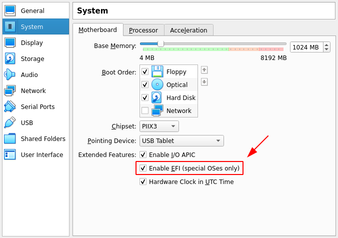
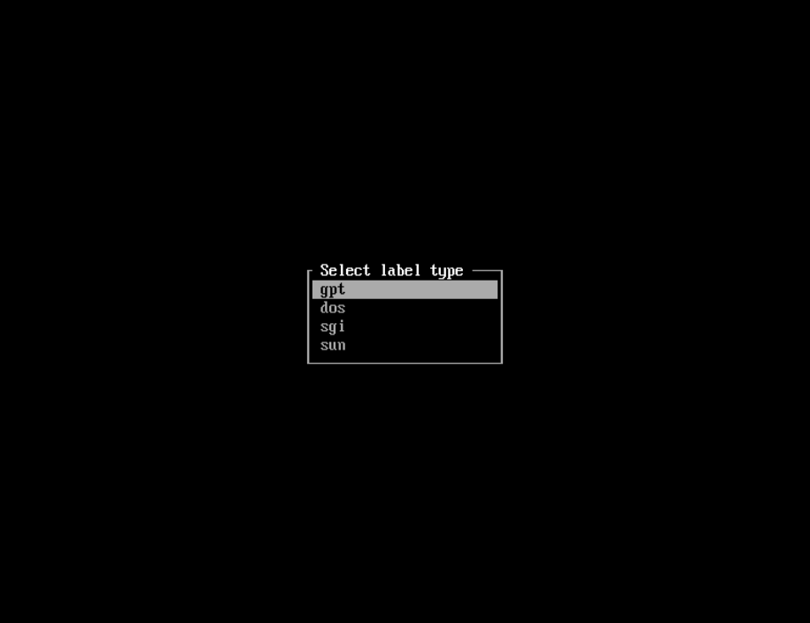
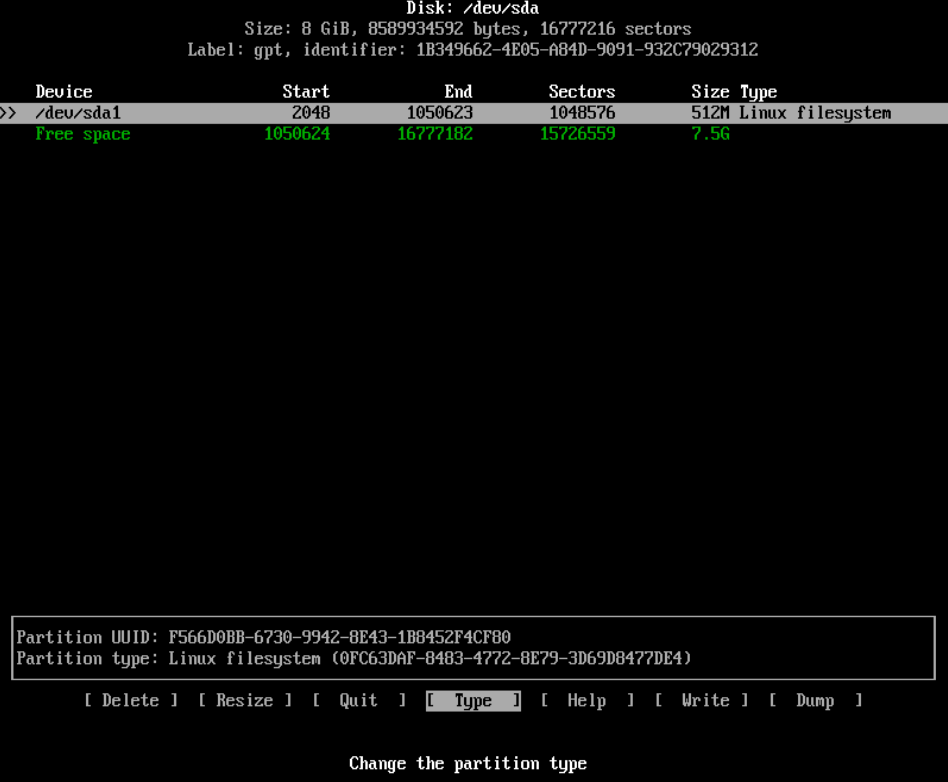
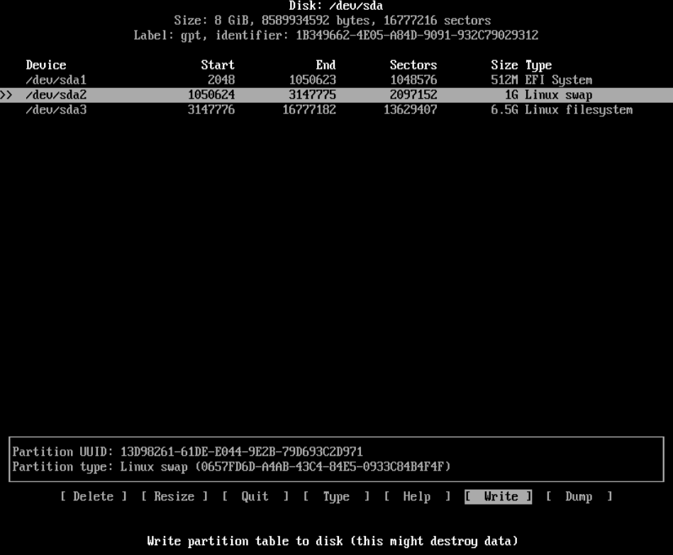
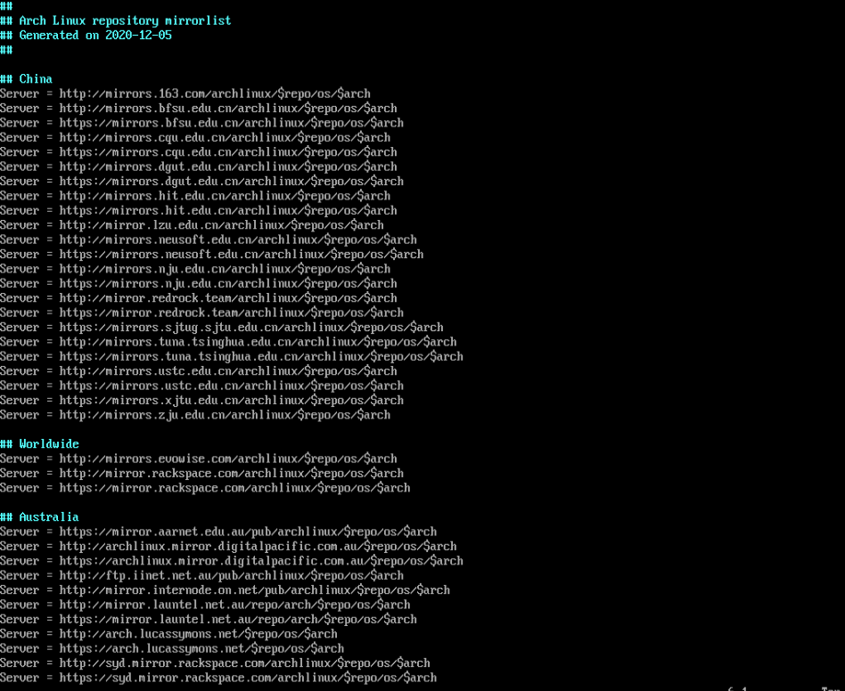

# Arch Linux

Arch Linux官方安装向导：https://wiki.archlinux.org/index.php/Installation_guide

## 下载镜像

官方网址：https://archlinux.org/download/

## VirtualBox打开EFI



勾选"Enable EFI"以在VirtualBox中打开EFI。

## 安装

### 验证启动方式

---

```
ls /sys/firmware/efi/efivars
```

如果命令没有报错，则使用的是UEFI;如果目录不存在则可能使用的是BIOS。

### 连接互联网

---

安装Arch Linux必须连通网络。

可以插入网线或使用wifi。

如果使用的是虚拟机，则不需要进行这一步操作。

#### 连接wifi

使用"iwd"连接wifi

```
# 进入iwd交互界面
iwctl

# 查看设备名
device list

# 扫描网络
station <设备名> sacn

# 查看网络名称
station <设备名> get-networks

# 连接网络
station <设备名> connent <网络名称>
```

### 更新系统时钟

---

```
timedatectl set-ntp true
```

### 磁盘分区

---

可以使用fdisk命令进行磁盘分区，也可以使用cfdisk命令进行磁盘分区。

cfdisk命令拥有交互界面。

```
cfdisk
```

输入命令进入**cfdisk**界面。



BIOS选择" dos "，UEFI选择" gpt "。


" New "创建一个新分区，并输入分区大小。


" Type "选择分区类型。



(boot分区)选择EFI System，(swap分区)选择Linux swap，(系统分区)选择Linux filesystem。


分区完成，" Write "写入磁盘。



#### BIOS磁盘分区

BIOS只需要分2个区，swap分区和系统分区。

swap分区：自定义

系统分区：剩余大小

| 挂载点 | 分区类型             |
|--------|----------------------|
| swap   | Linux swap(交换分区) |
| /mnt   | Linux(系统分区)      |


#### UEFI磁盘分区

UEFI需要创建3个分区：boot分区(启动分区)，swap分区，系统分区。

boot分区：" 512M-1G "之间。

swap分区：自定义。

系统分区：剩余大小。

| 挂载点    | 分区类型             |
|-----------|----------------------|
| /mnt/boot | EFI系统分区          |
| swap      | Linux swap(交换分区) |
| /mnt      | Linux                |


### 磁盘格式化

---

#### BIOS磁盘格式化

格式化系统分区

```
mkfs.ext4 /dev/sda2
```

格式化swap分区

```
mkswap /dev/sda1
```

激活swap分区

```
swapon /dev/sda1
```

#### UEFI磁盘格式化

格式化boot分区

```
mkfs.fat -F32 /dev/sda1
```

格式化系统分区

```
mkfs.ext4 /dev/sda3
```

格式化swap分区

```
mkswap /dev/sda2
```

激活swap分区

```
swapon /dev/sda2
```

### 挂载

BIOS只需要挂载系统分区

UEFI需要挂载boot分区(启动分区)和系统分区

#### BIOS挂载

将系统分区/dev/sda2挂载到/mnt目录

```
mount /dev/sda2 /mnt
```

#### UEFI挂载

将系统分区/dev/sda3挂载到/mnt目录

```
mount /dev/sda3 /mnt
```

创建boot分区的挂载点

```
mkdir /mnt/boot
```

将boot分区/dev/sda1挂载到/mnt/boot目录

```
mount /dev/sda1 /mnt/boot
```

### 修改镜像列表

---

将中国的源放置到最前面

```
vim /etc/pacman.d/mirrorlist
```



### 安装系统

---

```
pacstrap /mnt base linux linux-firmware
```

等待系统安装完成

### 配置系统

---

```
genfstab -U /mnt >> /mnt/etc/fstab
```

### 进入系统

---

```
arch-chroot /mnt
```

界面发生变化说明已经进入系统。

### 修改时区

---

```
ln -sf /usr/share/zoneinfo/Asia/Shanghai /etc/localtime
```

### 同步系统时间

---

```
hwclock --systohc
```

### 本地化设置

---

进入系统后没有编辑器，下载需要的编辑器

```
pacman -S neovim
```

修改/etc/locale.gen文件，去掉en_US.UTF-8 UTF-8的注释

```
nvim /etc/locale.gen
```

再执行locale-gen

```
locale-gen
```

创建/etc/locale.conf文件，并在/etc/locale.conf文件中添加"LANG=en_US.UTF-8"

```
nvim /etc/locale.conf

# 添加以下内容
LANG=en_US.UTF-8
```

### 网络配置

---

创建/etc/hostname文件，在文件中添加自己的主机名

```
nvim /etc/hostname

# 添加自己的主机名
```

添加hosts，在/etc/hosts中添加以下内容：

```
127.0.0.1     localhost

::1           localhost

127.0.1.1     主机名.localdomain 主机名
```

### 给root用户添加密码

---

```
passwd
```
连续输入两次密码即可。

输入密码时不会有字符显示。

### 安装grub引导

---

#### BIOS安装grub引导程序

BIOS只需要安装grub

安装" grub "

```
pacman -S grub
```

grub安装

```
grub-install --target=i386-pc /dev/sda
```

生成grub的配置文件

```
grub-mkconfig -o /boot/grub/grub.cfg
```

#### UEFI安装grub引导程序

UEFI需要额外安装"efibootmgr"

```
pacman -S grub efibootmgr
```

grub安装

```
grub-install --target=x86_64-efi --efi-directory=/boot
```

生成grub的配置文件

```
grub-mkconfig -o /boot/grub/grub.cfg
```

#### ps:

根据cpu选择安装"intel-ucode"或"amd-ucode"

```
pacman -S intel-ucode

或

pacman -S amd-ucode
```

双系统需要额外安装"os-prober"

```
sudo pacman -S os-prober
```

### 安装dhcpcd和iwd

dhcpcd用于新系统动态分配ip地址

iwd用于新系统连接wifi

```
pacman -S dhcpcd iwd
```

### 退出系统

```
exit
```

### 取消挂载

```
umount -R /mnt
```

### 重启电脑

```
reboot
```

## 重启进入系统后的设置

### 联网设置

---

启动dhcpcd

```
systemctl start dhcpcd

systemctl enable dhcpcd
```

wifi连接

```
systemctl start iwd

systemctl enable iwd
```

iwd交互命令

```
# 进入iwd交互界面
iwctl

# 查看设备
device list

# 扫描网络
station <设备名> sacn

# 查看网络名称
station <设备名> get-networks

# 连接网络
station <设备名> connent <网络名称>
```

设置好后可以ping一下看网络是否连通

```
ping baidu.com
```

### 更新系统

---

```
pacman -Syyu
```

### 安装软件包

---

```
pacman -S base-devel
```

### 添加普通用户

---

```
pacman -S -mG wheel <用户名>
```

### 给新用户设置密码

---

```
passwd <用户名>
```

### 修改/etc/sudoers文件

---

```
nvim /etc/sudoers
```

在/etc/sudoers文件中找到以下行,并将这一行的注释放开以可以使用**sudo**命令

```
%wheel ALL=(ALL) ALL
```

### 退出root用户

---

```
exit
```

使用新用户登录

## 安装完成

待更：dwm...
