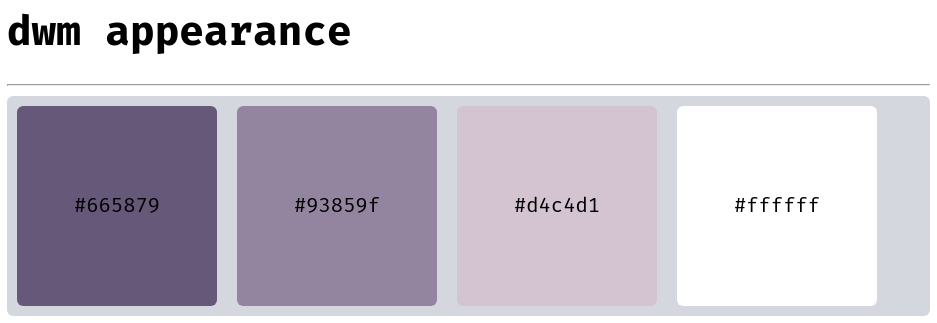

# dwm

suckless官网：[suckless.org](https://suckless.org/)

[TOC]

## 1. 安装 xorg + xorg-xinit + git + base-devel

```sh
sudo pacman -S xorg xorg-xinit base-devel git 
```

## 2. 安装yay

`yay`是可以安装`AUR`中软件包的工具。

```sh
git clone https://aur.archlinux.org/yay.git

cd yay

makepkg -si
```

## 3. 安装字体

```sh
sudo pacman -S ttf-fira-code wqy-zenhei

yay -S ttf-symbola nerd-fonts-complete
```

## 4. 安装终端模拟器

### st

---

文章地址：[Arch Linux 下安装 st (终端模拟器)](https://blog.csdn.net/weixin_44335269/article/details/117848592?spm=1001.2014.3001.5501)

### alacritty

---

```sh
sudo pacman -S alacritty
```

`alacritty`的配置文件为：`~/.config/alacritty/alacritty.yml`。

## 5. 克隆 dwm 源码

使用源码安装，每次`修改源码`都需要`重新编译安装`。

```sh
git clone https://git.suckless.org/dwm
```

如果使用的终端模拟器不是`st`，需要修改`config.def.h`文件中的以下代码：

```c
/* 将其中的st修改为安装的终端模拟器 */
static const char *termcmd[] = { "st", NULL};
```

## 6. 编译安装 dwm

```sh
# 进入dwm目录
cd dwm

# 编译安装
sudo make clean install
```

## 7. 使用 startx 启动 dwm

```sh
# ~/.xinitrc文件本来是没有的，需要手动添加
vim ~/.xinitrc

# 在.xinitrc文件中添加以下代码
exec dwm
```

重启后，使用`startx`命令启动`dwm`。

```sh
startx
```

启动后，可以看到`dwm`最原始的界面。

默认的`MODKEY`是`Alt`键。

按下`MODKEY`+`Shift`+`Enter`启动终端。


将以下代码添加到`shell`的配置文件中，可以在登录后自动启动`startx`。

```sh
# auto startx
if [ -z "${DISPLAY}" ] && [ "${XDG_VTNR}" -eq 1 ]; then
	exec startx
fi
```

## 8. dwm 配置

编译安装后，会产生`config.h`文件。

通过`config.h`文件配置`dwm`。

### config.h 文件源码说明

---

#### 外观配置

---

修改以下代码以配置`dwm`的`字体`，`颜色`等。


例：

将默认的`蓝色配色`修改为`紫色配置`。




#### 标签栏的显示 + 软件的窗口规则

---

修改以下代码以配置`dwm`标签栏的显示效果和软件的窗口规则。

窗口规则：`软件打开的标签`，`窗口是否浮动`等。


#### 添加命令 + 定义快捷键

---

修改以下代码以配置`dwm`的程序命令和快捷键。


例：

添加`flameshot`截图命令和快捷键。

```c
/* 添加命令 */
static const char *flameshot[] = { "flameshot", "gui", NULL};

/* 添加快捷键：mod+s */
{ MODKEY,       XK_s,      spawn,        {.v = flameshot } },
```

## 9. dwm 补丁

通过`补丁`为`dwm`添加额外的功能。

补丁下载地址：[https://dwm.suckless.org/patches/](https://dwm.suckless.org/patches/)

### 打补丁

---

将补丁文件放在`dwm`目录下。通过`patch`命令打补丁。

如果打补丁失败，需要手动添加。

例：

打一个`隐藏没有程序运行的标签`的补丁。

```sh
patch < dwm-hide_vacant_tags-6.2.diff
```

只有`标签1`下有程序运行，所以只显示`标签1`。


### 推荐补丁

---

```
透明补丁：alphasystray.diff

临时小窗口：dwm-scratchpad-6.2.diff

隐藏空标签：dwm-hide_vacant_tags-6.2.diff

窗口间距：dwm-vanitygaps-20190508-6.2.diff

自动启动脚本：dwm-autostart-20161205-bb3bd6f.diff

窗口全屏：dwm-actualfullscreen-20191112-cb3f58a.diff

状态栏显示多个窗口信息：dwm-awesomebar-20191003-80e2a76.diff
```

## 10. 状态栏右侧显示信息

使用`xsetroot`命令可以在`dwm`状态栏的右侧显示需要的信息。

```sh
# 安装xsetroot
sudo pacman -S xsetroot

# 使用xsetroot命令在状态栏右侧显示"hello dwm"
xsetroot -name "hello dwm"
```


配合`dwm-autostart-20161205-bb3bd6f.diff`补丁和`自定义脚本`可以在系统启动时显示需要的系统信息。

例：

在状态栏右侧显示系统时间。

打上`dwm-autostart-20161205-bb3bd6f.diff`后，在`dwm.c`文件中找到以下代码：

```c
void
runAutostart(void) {
  system("cd ~/scripts; ./autostart_blocking.sh")
  system("cd ~/scripts; ./autostart.sh &")
}
```

可以修改为`自定义脚本`目录。

```c
void
runAutostart(void) {
  system("cd ~/dwm/scripts; ./autostart.sh &")
}
```

<++>


