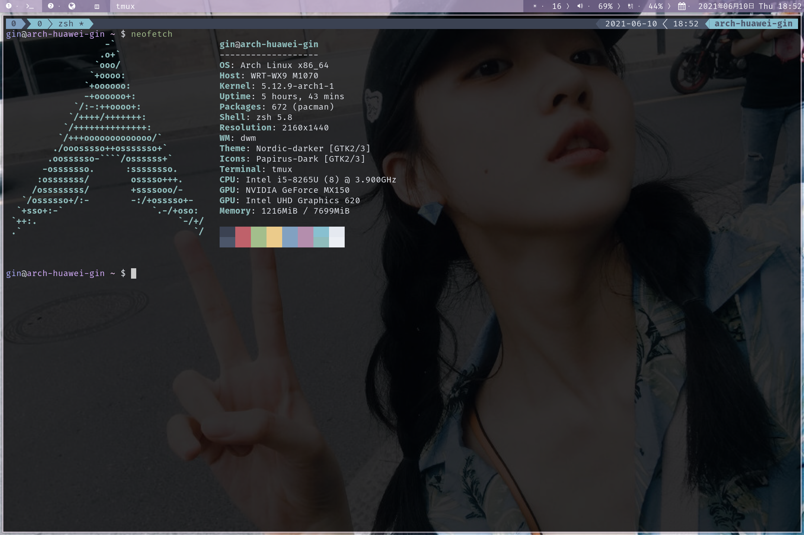

# tmux终端复用 (使用+插件)

[TOC]

## 1. 会话与窗口

在终端窗口输入命令,用户与计算机的这种临时的交互,称为一次`会话`。

窗口与其中启动的进程是连在一起的。

打开窗口，会话开始; 关闭窗口，会话结束。会话内部的进程也会终止。

## 2. 前缀键 (prefix)

`tmux`的快捷键都要通过前缀键`prefix`唤起。默认的前缀键`prefix`是`ctrl+b`。

## 3. 会话管理

### 新建会话

---

第一个启动的，`tmux`会话窗口，编号是0。第二个窗口的编号是1。

新建一个指定名称的会话

```sh
tmux new -s <session-name>
```

### 分离会话

---

`tmux detach`命令,就会将当前会话与窗口分离。

```sh
tmux detach
```

执行上面的命令，会退当前的tmux窗口，但是会话和里面的进程仍然在后台运行。

### 列出会话

---

`tmux ls`命令可以查看当前所有的tmux会话。

```sh
tmux ls 或者 tmux list-session
```

### 接入会话

---

`tmux attach`命令用于重新接入某个已经存在的会话。

```sh
# 使用会话编号
tmux attach -t 0

# 使用会话名称
tmux attach -t <session-name>
```

### 杀死会话

---

`tmux kill-session`命令用于杀死某个会话。

```sh
# 使用会话编号
tmux kill-session -t 0

# 使用会话名称
tmux kill-session -t <session-name>
```

### 切换会话

---

`tmux switch`命令用于切换会话。

```sh
# 使用会话编号
tmux switch -t 0

# 使用会话名称
tmux switch -t <session-name>
```

### 重命名会话

---

`tmux rename-session`命令用于重命名会话。

```sh
# 将0号会话重命名
tmux rename-session -t 0 <new-name>
```


### 会话快捷键

---

| 快捷键       | 描述           |
|--------------|----------------|
| `prefix` `d` | 分离当前会话   |
| `prefix` `s` | 列出所有会话   |
| `prefix` `$` | 重命名当前会话 |


## 4. 窗口管理

### 新建窗口

---

`tmux new-window`命令用来创建新窗口

```sh
tmux new-window

# 新建一个指定名称的窗口
tmux new-window -n <window-name>
```

### 切换窗口

---

`tmux select-window`命令用来切换窗口

```sh
# 切换到指定编号的窗口
tmux select-window -t <window-number>

# 切换到指定名称的窗口
tmux select-window -t <window-name>
```

### 重命名窗口

---

`tmux rename-window`命令用于为当前窗口起名

```sh
tmux rename-window <new-name>
```

### 窗口快捷键

---

| 快捷键              | 描述                                     |
|---------------------|------------------------------------------|
| `prefix` `c`        | 创建一个新窗口，状态栏会显示多个窗口信息 |
| `prefix` `p`        | 切换到上一个窗口                         |
| `prefix` `n`        | 切换到下一个窗口                         |
| `prefix` `<number>` | 切换到指定编号的窗口                     |
| `prefix` `w`        | 从列表中选择窗口                         |
| `prefix` `,`        | 重命名窗口                               |

## 5. 窗格操作

tmux可以将窗口分成多个窗格,每个窗格运行不同的命令

### 划分窗格

---

`tmux split-window`命令用于划分窗格。

```sh
# 划分上下两个窗格
tmux split-window

# 划分左右两个窗格
tmux split-window -h
```

### 移动光标

---

`tmux select-pane`命令用于在窗格间移动光标。

```sh
# 光标移动到上窗格
tmux select-pane -U

# 光标移动到下窗格
tmux select-pane -D

# 光标移动到左窗格
tmux select-pane -L

# 光标移动到右窗格
tmux select-pane -R
```

### 交换窗格位置

---

`tmux swap-pane`命令用于交换窗格的位置

```sh
# 当前窗格上移
tmux swap-pane -U

# 当前窗格下移
tmux swap-pane -D
```

### 窗格快捷键

---

| 快捷键       | 描述                                         |
|--------------|----------------------------------------------|
| `prefix` `%` | 划分左右两个窗格                             |
| `prefix` `"` | 划分上下两个窗格                             |
| `prefix` `;` | 光标移动到上一个窗格                         |
| `prefix` `o` | 光标移动到下一个窗格                         |
| `prefix` `{` | 当前窗格与上一个窗格换位                     |
| `prefix` `}` | 当前窗格与下一个窗格换位                     |
| `prefix` `x` | 关闭当前窗格                                 |
| `prefix` `!` | 将当前窗格拆分为一个独立的窗格               |
| `prefix` `z` | 当前窗格全屏显示，再使用一次会变回原来的大小 |
| `prefix` `q` | 显示窗格编号                                 |

## 6. 插件

### 插件管理器

---

插件管理器地址：[tpm](https://github.com/tmux-plugins/tpm)

#### 安装

---

克隆仓库

```sh
git clone https://github.com/tmux-plugins/tpm ~/.config/tmux/plugins/tpm
```

添加以下内容到`tmux.conf`文件的底部

```sh
# List of plugins
set -g @plugin 'tmux-plugins/tpm'
set -g @plugin 'tmux-plugins/tmux-sensible'

run '~/.config/tmux/plugins/tpm/tpm'
```

重新加载`tmux.conf`文件

```sh
tmux source ~/.config/tmux/tmux.conf
```

#### 安装，卸载，更新插件

---

添加插件地址到`tmux.conf`文件

```sh
set -g @plugin '<plugin addr>'
```

按下快捷键`安装`，`卸载`，`更新`插件

| 快捷键               | 描述     |
|----------------------|----------|
| `prefix` `shift` `i` | 安装插件 |
| `prefix` `shift` `u` | 更新插件 |
| `prefix` `alt` `u`   | 卸载插件 |

插件安装目录：`~/.config/tmux/plugins/`。

### nord-tmux

---

插件地址：[nord-tmux](https://github.com/arcticicestudio/nord-tmux)

`tmux`的`nord`主题。

添加以下内容到`tmux.conf`文件中

```sh
set -g @plugin 'arcticicestudio/nord-tmux'
```




