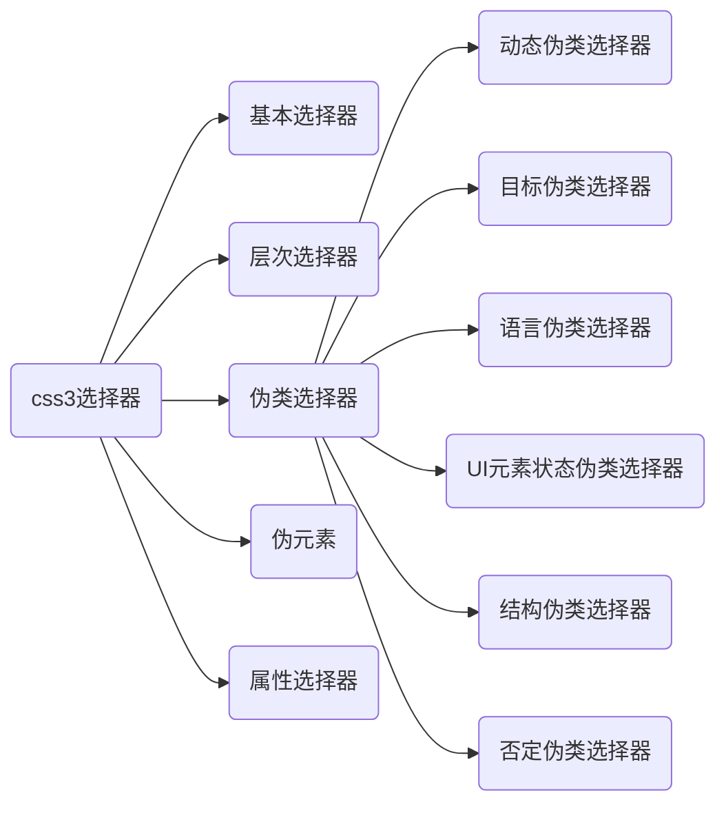
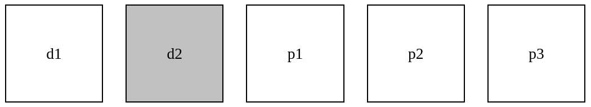
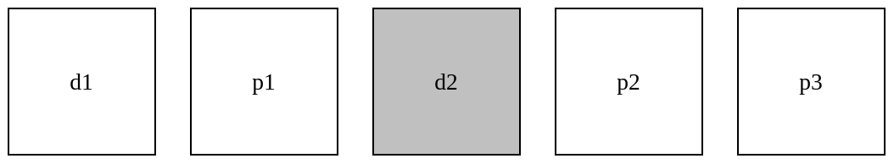

# CSS

**W3School的CSS教程**：https://www.w3school.com.cn/CSS/index.asp

## CSS的引入方式

CSS样式表可以分为：**行内样式表（行内式）**，**内部样式表（嵌入式）**，**外部样式表（外链式）**。

### 行内样式表

在元素标签中直接引用**style**属性来设置CSS样式，适合修改简单样式。

### 内部样式表

将CSS代码抽取出来，单独放在一个style标签中。

### 外部样式表

将CSS样式单独写在一个CSS文件中，再从外部引入页面使用。

## Chrome调试工具

使用Chrome调试工具可以调试HTML结构和CSS样式。

使用方法

```
* 左边式HTML元素结构，右边是CSS样式。
* 右边CSS样式可以改动数值（左右箭头或直接输入）和查看颜色。
* ctrl+0回复浏览器大小。
* 点击元素，发现如果没有样式引入，则可能是类名或样式引入错误。
* 如果样式正确引入，但是样式前面由黄色叹号提示，则是样式属性书写错误。
```

## Emmet语法

Emmet语法前身是Zen coding，使用的是缩写来提高HTML/CSS的编写速度。

### 快速生成HTML结构语法

```
* 生成标签，直接输入标签名再按Tab键即可。
* 同时生成多个同样的标签，加上*就可以实现。
* 生成有父子级关系的标签，可以使用>。例如，ul>li就可以实现。
* 生成有兄弟关系的标签，可以使用+。例如，div+p就可以实现。
* 生成带有类名或id名的标签，直接写.demo或#two，再按Tab键就可以实现。
* 生成的div类名是有顺序的，可以使用自增符号$。
* 生成的标签内部带有文本可以通过{}实现。
```

## CSS选择器

css3选择器可以分为5大类：**基本选择器**，**层次选择器**，**伪类选择器**，**伪元素**，**属性选择器**。

伪类选择器又分为6种：**动态伪类选择器**，**目标伪类选择器**，**语言伪类选择器**，**UI元素状态伪类选择器**，**结构伪类选择器**，**否定伪类选择器**。




### 基本选择器

| 选择器              | 类型       | 描述                                             |
|---------------------|------------|--------------------------------------------------|
| *                   | 通配选择器 | 选择文档中所有html元素                           |
| E                   | 元素选择器 | 选择指定类型的html元素                           |
| #id                 | ID选择器   | 选择指定ID属性值为"id"的任意类型元素             |
| .class              | 类选择器   | 选择指定class属性值为"class"的任意类型的多个元素 |
| selector1,selectorN | 群组选择器       | 将每一个选择器匹配的元素集合并                                             |

类选择器在一个页面中可以有多个相同的类名，而ID选择器其ID值在整个页面中是唯一的。

### 层次选择器

层次选择器通过dom之间的层次关系获取元素，主要层次关系包括**后代**，**父子**，**相邻兄弟**，**通用兄弟**几种关系。

| 选择器 | 类型           | 描述                                                  |
|--------|----------------|-------------------------------------------------------|
| E F    | 后代选择器     | 选择匹配的F元素，且匹配的F元素被包含在匹配的E元素内   |
| E>F    | 子选择器       | 选择匹配的F元素，且匹配的F元素是所匹配的E元素的子元素 |
| E+F    | 相邻兄弟选择器 | 选择匹配的F元素，且匹配的F元素紧位于匹配的E元素后面   |
| E~F   | 通用选择器           | 选择匹配的F元素，且位于匹配的E元素后的所有匹配的F元素                                                  |

(E+F)相邻兄弟选择器只能选中紧挨这E元素的第一个F元素。

(E~F)通用选择器能选择E元素之后的所有匹配的F元素。

### 动态伪类选择器

动态伪类并不存在于html中，只有当用户和网站交互的时候才能体现出来。动态伪类包含2种。

第一种是在链接中常看到的锚点伪类。

第二种是用户行为伪类。

| 选择器    | 类型               | 描述                                                                      |
|-----------|--------------------|---------------------------------------------------------------------------|
| E:link    | 链接伪类选择器     | 选择匹配的E元素，而且匹配元素被定义了超链接并从未被访问过，常用于链接锚点 |
| E:visited | 链接伪类选择器     | 选择匹配的E元素，而且匹配元素被定义了超链接并已被访问过，常用于链接锚点   |
| E:active  | 用户行为伪类选择器 | 选择匹配的E元素，且匹配元素被激活，常用于锚点于按钮                       |
| E:hover   | 用户行为伪类选择器 | 选择匹配的E元素，且用户鼠标在停留在元素E上                                |
| E:foucs   | 用户行为伪类选择器 | 选择匹配的E元素，且匹配元素获得焦点                                       |
锚点伪类的设置必须遵循一个"爱恨原则"LoVe/HAte，也就是"link > visited > hover > active"。

### UI元素状态伪类选择器

UI元素状态伪类选择器主要用于form表单元素，以提高页面的人际交互，操作逻辑以及页面的整体美观。

| 选择器    | 类型               | 描述                                 |
|-----------|--------------------|--------------------------------------|
| E:checked | 选中状态伪类选择器 | 匹配选中的复选按钮或单选按钮表单元素 |
| E:enable  | 启用状态伪类选择器 | 匹配所有启用的表单元素                                 |
| E:disable      | 不可用状态伪类选择器               | 匹配所有禁用的表单元素                                 |

### 结构伪类选择器

| 选择器              | 描述                                                                                              |
|---------------------|---------------------------------------------------------------------------------------------------|
| E:first-child       | 作为父元素的第一个子元素的元素E，与E:nth-child(1)等同                                             |
| E:last-child        | 作为父元素的最后一个子元素的元素E，于E:nth-last-child(1)等同                                      |
| E:root              | 选择匹配元素E所在文档的根元素，在html文档中，根元素始终是html                                     |
| E F:nth-child(n)    | 选择父元素E的第n个子元素F，其中n可以是整数，关键字(even，odd)，可以是公式(2n+1)，而且n的起始值为1 |
| E:nth-last-child(n) | 与nth-child选择器的计算顺序刚好相反                                                               |
| E:nth-of-type(n)    | 选择父元素内具有指定类型的第n个E元素                                                              |
| E:first-of-type     | 选择父元素内据用指定类型的第一个E元素，与E:nth-of-type(1)等同                                     |
| E:last-of-type      | 选择父元素具有指定类型的最后一个E元素，与E:nth-last-of-type(1)等同                                |
| E:only-child        | 选择父元素只包含一个子元素，且该子元素匹配E元素                                                   |
| E:only-of-type      | 选择父元素只包含一个同类型的子元素，且该子元素匹配E元素                                           |
| E:empty             | 选择没有子元素的元素，且该元素也不包含任何文本节点                                                |

**nth-child与nth-of-type的区别**

**nth-child**匹配的子元素要在父元素中的第n个位置。

```css
.box div:nth-child(2) {
  background-color: #c0c0c0;
}
```



从上面的图来看，**d2**在父元素的第2个位置时，元素匹配到了。


但是，**d2**在父元素的第3个位置时，元素就没有匹配到。

**nth-of-type**匹配的是指定类型的第n个子元素。

```
.box div:nth-of-type(2) {
  background-color: #c0c0c0;
}
```



从上图可以看出，**d2**在父元素的第3个位置，但仍然匹配到了。

### 伪元素

| 伪元素         | 描述                                        |
|----------------|---------------------------------------------|
| ::first-letter | 用于选择文本快的第一个字母                  |
| ::first-line   | 用于匹配元素的第一行文本                    |
| ::before       | 在元素前面插入一些内容，必须有"content"属性 |
| ::after        | 在元素后面插入一些内容，必须有"content"属性 |
| ::selection    | 用于匹配突出显示的文本                      |

### 属性选择器

基于元素的属性来匹配元素。

| 选择器  | 描述                        |
|---------|-----------------------------|
| E[attr] | 选择匹配具有属性attr的E元素 |
| <++>    | <++>                        |
| <++>    | <++>                        |
| <++>    | <++>                        |
| <++>    | <++>                        |
| <++>    | <++>                        |
| <++>    | <++>                        |
| <++>    | <++>                        |

## 边框(border)

边框主要包括3个类型值：**border-width**，**border-color**，**border-style**。

将3个属性合并在一起，其缩写语法：

```
border: border-width border-color border-style
```

### 边框类型(border-style)

| 属性值  | 描述                                                             |
|---------|------------------------------------------------------------------|
| none    | 定义无边框                                                       |
| hidden  | 与"none"相同，不过应用于表时除外，对于表，hidden用于解决边框冲突 |
| dotted  | 定义点状边框                                                     |
| dashed  | 定义虚线边框                                                     |
| solid   | 定义实线边框                                                     |
| double  | 定义双线边框                                                     |
| groove  | 定义3D凹槽边框，其效果取决与border-color的值                     |
| ridge   | 定义3D垄状边框，其效果取决与border-color的值                     |
| inset   | 定义3D inset边框，其效果取决于border-color的值                   |
| outset  | 定义3D outset边框，其效果取决于border-color的值                  |
| inherit | 规定应该从父元素继承边框样式                                     |

## 盒子阴影(box-shadow)

box-shadow是CSS3新增的一个属性，用来定义元素的盒子阴影

### box-shadow的属性

| 属性          | 描述                                                         |
|---------------|--------------------------------------------------------------|
| none          | 默认值，表示没有阴影                                         |
| inset         | 阴影类型，不设置则为外阴影;设置为"inset"，就是内阴影         |
| x-offset      | 阴影水平偏移量，可正可负。取正值阴影在右边，取负值阴影在左边 |
| y-offset      | 阴影垂直偏移量，可正可负。取正值阴影在底部，取负值阴影在顶部 |
| blur-radius   | 阴影模糊半径，只能取正值。0表示没有模糊效果，数值越大越模糊  |
| spread-radius | 阴影扩展半径，可正可负。取正值阴影扩大，取负值阴影缩小       |
| color         | 阴影颜色，不同浏览器默认颜色不同，Webkit内核的浏览器为透明·  |

**box-shadow属性书写顺序**

```
box-shadow: none | [inset x-offset y-offset blur-radius spread-radius color]
```

直接在图片上添加内阴影的效果是没有效的，与在图片上直接使用border-radius类似，在img标签外添加一个容器标签，并将img作为容器标签的背景图片，就可以实现border-radius效果

## 背景(background)

背景是一个非常常用的属性

### 背景的基本属性

| 属性                  | 描述                   |
|-----------------------|------------------------|
| background-color      | 背景颜色               |
| background-image      | 背景图片               |
| background-repeat     | 背景图片的展示方式     |
| background-attachment | 背景图片是固定还是滚动 |
| background-position   | 背景图片位置           |

**background属性书写顺序**

```
background: <background-color> | <background-image> | <background-repeat> | <background-attachment> | <background-position>
```

### background-color属性

语法：

```
background-color: transparent | <color>
```

background-color属性的默认值为"transparent"，不设置任何颜色时，背景为透明

### background-image属性

实际开发常见于logo或一些装饰性的小图像或超大的背景图像等。优点是非常便于控制位置

语法：

```
background-image: none | <url>
```

### background-repeat属性

```
background-repeat: repeat | no-repeat | repeat-x | repeat-y
```

**属性值描述**

| 属性值    | 描述                   |
|-----------|------------------------|
| repeat    | 图片沿x轴和y轴同时平铺 |
| no-repeat | 图片不平铺             |
| repeat-x  | 图片沿x轴平铺          |
| repeat-y  | 图片沿y轴平铺          |

### background-attachment属性

语法：

```
background-attachment: scroll | fixed
```

**属性值描述** 

| 属性值 | 描述                               |
|--------|------------------------------------|
| scroll | 背景图片会随着浏览器滚动条一起滚动 |
| fixed  | 背景图片固定不动                   |

### background-position属性

语法：

```
background-position: <percentage> | <length> | <left|center|right> | <top|center|bottom>
```

background-position属性的默认值为"(0,0) | (0%,0%) | (left top)"

### 新增属性

在CSS3中background属性依然保持以前的用法，只是追加了一些新属性

| 属性              | 描述                                       |
|-------------------|--------------------------------------------|
| background-origin | 指定绘制背景图片的起点                     |
| background-clip   | 指定背景图片的显示范围                     |
| background-size   | 指定背景图片的尺寸大小                     |
| background-break  | 指定内联元素的背景图片进行平铺时的循环方式 |

### 背景颜色半透明

CSS提供了背景颜色半透明的效果。

```
background: rgba(0,0,0,0.3);
```

## 文本(text)

文本功能主要分为3大类：**字体**，**颜色**，**文本**。

### 字体类型

| 属性             | 描述                           | 取值                                                      |
|------------------|--------------------------------|-----------------------------------------------------------|
| font-family      | 定义字体的类型                 |                                                           |
| font-style       | 定义字体样式                   | normal(默认值)，italic(斜体)，oblique(倾斜)               |
| font-weight      | 定义字体粗细                   | normal(默认值)，bold(粗体)，bolder(特粗体)，lighter(细体) |
| font-size-adjust | 定义是否强制对文本使用同一尺寸 |                                                           |
| font-stretch     | 定义是否横向拉伸变形字体       |                                                           |
| font-variant     | 定义字体大小写                 | normal(默认值)，small-caps(小型的大写字母体字)            |

**font**的写法

```
font: font-style font-weight/line-height font-family;
```

### 文本类型

| 属性            | 描述                               | 取值                                                                                                                                                     |
|-----------------|------------------------------------|----------------------------------------------------------------------------------------------------------------------------------------------------------|
| word-spacing    | 定义词与词之间的间距               | normal(默认值)，length(设置词与词之间的距离值，可以是负值)                                                                                               |
| letter-spacing  | 定义字符之间的间距                 | normal(默认值)，length(设置字符与字符之间的间距，可以是负值)                                                                                             |
| vertical-align  | 定义文本的垂直对齐方式             | baseline(默认值)，sub(上标对齐)，super(下标对齐)，bottom(行框低端对齐)，text-bottom(行内文本底端对齐)，top(顶端对齐)，middle(居中对齐)，百分比数字，长度 |
| text-decoration | 定义文本的修饰线                   | none(默认值)，underline(下划线)，overline(上划线)，line-through(删除线)，blink(闪烁线)                                                                   |
| text-indent     | 定义文本首行缩进                   | length(长度单位)，百分比                                                                                                                                 |
| text-align      | 定义文本水平对齐方式               | left(左对齐)，center(水平居中)，right(右对齐)，justify(两端对齐)                                                                                         |
| line-height     | 定义文本行高                       | normal(默认值)，长度值，百分比值，数字                                                                                                                   |
| text-transform  | 定义文本大小写                     | none(默认值)，uppercase(大写)，lowercase(小写)，capitalize(首字大写)                                                                                     |
| text-shadow     | 定义文本阴影效果                   |                                                                                                                                                          |
| white-space     | 定义文字之间和文本之间的空白符间距 | normal(默认值)，nowrap(空白符合并，换行符忽略)，pre(空白符，换行符保留)，pre-wrap(空白符，换行符保留)，pre-line(空白符合并，换行符保留)                  |
| direction       | 控制文本流入的方向                 | ltr(默认值)，rtl(文本从右到左流入)，inherit(文本流入方向由继承获得)                                                                                      |


## CSS的元素显示模式

元素的显示模式就是元素是以什么方式显示的。

HTML中的元素一般可以分为块元素和行内元素。

### 块元素（block element）

```
* 在页面中独占一行的元素。&lt;div&gt;是最典型的块元素
* 高度，宽度，外边距以及内边距都可以控制
* 宽度默认是容器（父级宽度）的100%
* 是一个容器盒子，里面可以放任何元素
* 在网页中一般通过块元素来对网页进行布局
```

### 行内元素（inline element）

```
* 在页面中不会独占一行的元素称为行内元素
* 相邻的行内元素在一行上，一行可以显示多个行内元素
* 宽高的设置是无效的
* 默认宽度就是文本本身内容的宽度
* 行内元素只能容纳文本或其他行内元素，一般主要用来包裹文本
```

### 行内块元素

行内块元素同时具有块元素和行内元素的特点。例如，&lt;img /&gt;，&lt;input&gt;，&lt;td&gt;。

```
* 和相邻的行内元素在一行上，但是元素之间会有空白间隙，一行可以显示多个
* 默认宽度就是其本身的宽度
* 高度，行高，外边距以及内边距可以控制
* 文字类的元素里面不能放块元素，例如，&lt;p&gt;元素中不能放任何任何的块元素。一般情况是在块元素中放行内元素，而不会在行内元素中放块元素
* 浏览器在解析网页的时候，会自动对网页中不符合规范的内容进行修正
```

### 元素显示模式总结

| 元素模式   | 元素列表                 | 设置样式               | 默认宽度           | 包含关系                 |
| ---------- | ------------------------ | ---------------------- | ------------------ | ------------------------ |
| 块元素     | 一行只能放一个块元素     | 可以设置宽度高度       | 容器的100%         | 容器级可以包含任何元素。 |
| 行内元素   | 一行可以放多个行内元素   | 不可以直接设置宽度高度 | 本身内容的默认宽度 | 容纳文本或其他行内元素。 |
| 行内块元素 | 一行可以放多个行内块元素 | 可以设置宽度高度       | 本身内容的默认宽度 |                          |

### 元素显示模式的转换

一个模式的元素需要另一个元素模式的特征。

**转换成块元素**

```CSS
display:block;
```

**转换成行内元素**

```CSS
display:inline;
```

**转换成行内块元素**

```CSS
display:inline-block;
```

---

## CSS的三大特性

CSS有三个非常重要的特性：==层叠性==，==继承性==，==优先级==。

### 层叠性

给相同选择器设置了相同的样式，此时一个样式就会==覆盖（层叠）==另一个冲突的样式，层叠主要解决的是样式冲突的问题。

**层叠性的原则**

> * 样式冲突遵循就近原则，哪一个样式离结构近，就执行哪一个样式。
> * 样式不冲突，则不会重叠。

### 继承性

CSS中的继承：子元素会继承父元素的某些样式。

子元素可以继承父元素的样式：（text-，font-，line-这些元素的开头的可以继承，以及color属性）。

**行高的继承**

```CSS
选择器 {
    font: 12px/1.5 'Microsoft YaHei';
}
```

> * 行高可以跟单位也可以不跟单位。
> * 如果子元素没有设置行高则会继承父元素的行高1.5。
> * 此时子元素的行高：当前子元素的字体大小的1.5倍。
> * 这样的写法优势在于子元素可以根据自己的字体大小自动调整行高。

### 优先级

当一个元素指定多个选择器时，就会产生优先级。

> * 选择器相同，则执行层叠性。
> * 选择器不同，则根据选择器权重执行。

**选择器的权重**

| 选择器               | 权重       |
| -------------------- | ---------- |
| 继承或通配符选择器   | 0，0，0，0 |
| 元素选择器           | 0，0，0，1 |
| 类选择器，伪类选择器 | 0，0，1，0 |
| id选择器             | 0，1，0，0 |
| 行内样式             | 1，0，0，0 |
| !important           | 无穷大     |

> * 继承的权重是0，如果该元素没有被选中，不管父元素权重多高，子元素得到的权重对视0。
> * 权重叠加：如果使用复合选择器，则会有权重的叠加，需要计算权重。
>

---

## CSS字体属性

CSS fonts（字体）属性用于定义字体系列，大小，粗细，字体样式。

### font-family字体系列

CSS使用font-family属性定义文本的字体系列。

语法：

```CSS
选择器 {
    font-family: 属性值;
}
```


> * 可以设置多种字体。
> * 多字体之间必须使用英文状态下的逗号“,”分隔。
> * 使用引号包括多单词组成的字体名称。
> * 尽量使用默认字体。

### 字体大小

CSS使用font-size属性来定义字体的大小。

语法：

```CSS
选择器 {
    font-size: 属性值;
}
```


> * px(像素)是网页中最常用的单位。
> * 谷歌浏览器默认字体大小为16px。
> * 可以给&lt;body&gt;标签设置一个全局的字体大小。
> * 标题标签需要单独指定字体大小。

### 字体粗细

CSS使用font-weight属性设置字体的粗细。

```CSS
选择器 {
    font-weight: 属性值;
}
```

font-weight的属性值

| 属性值            | 作用                                               |
| ----------------- | -------------------------------------------------- |
| normal            | 默认值（不加粗）                                   |
| bold              | 定义粗体（加粗）                                   |
| number（100-900） | 400等同于normal，700等同于加粗bold，不需要加单位。 |

### 文字样式

CSS使用font-style属性设置字体的风格。

语法：

```CSS
选择器 {
    font-style: 属性值;
}
```

font-style的属性值

| 属性值 | 作用                           |
| ------ | ------------------------------ |
| normal | 默认值，浏览器会显示标准字体。 |
| italic | 浏览器会显示斜体的字体样式。   |


> * 平时很少使用斜体，一般需要将斜体改为正常字体。

### 字体的复合属性

复合属性可以将所有字体样式合起来写，以节约代码量。

语法：

```CSS
选择器 {
    font: font-style font-weight font-size/line-height font-family;
}
```


> * 使用font属性时，必须按照严格按照语法格式书写，==不能更换顺序==，且属性之间使用空格分隔。
> * 不设置属性值则使用默认值，但是必须保留==font-size==和==font-family==这两个属性，否则font属性将不起作用。

### 字体属性总结

| 属性        | 含义     | 注意点                                             |
| ----------- | -------- | -------------------------------------------------- |
| font-size   | 字号     | 通常使用px（像素）作为单位。                       |
| font-family | 字体     | 按需求设置。                                       |
| font-weight | 字体粗细 | 加粗为700或bold，正常为100或normal，不需要带单位。 |
| font-style  | 字体样式 | 斜体为italic                                       |
| font        | 字体连写 | 严格按语法格式书写，字号和字体属性必须出现。       |

---

## CSS文本属性

CSS text（文本）属性可以定义文本的外观，比如文本的颜色，对齐方式，缩进，行间距等。

### 文本颜色

CSS使用==color==属性定义文本的颜色。

```CSS
选择器 {
    color: 属性值;
}
```

颜色的表示方法

| 表示方法         | 属性值           |
| ---------------- | ---------------- |
| 预定义的颜色值   | red，green等。   |
| 十六进制（常用） | #FF0000等。      |
| RGB代码          | rgb(255,0,0)等。 |

### 文本对齐

CSS使用==text-align==属性设置文本内容的水平对齐方式。

```CSS
选择器 {
    text-align: 属性值;
}
```

| 属性值 | 作用           |
| ------ | -------------- |
| left   | 左对齐（默认） |
| right  | 右对齐         |
| center | 居中           |

### 文本装饰

CSS使用==text-decoration==属性添加文本修饰，如下划线，删除线，上划线等。

语法：

```CSS
选择器 {
    text-decoration: 属性值;
}
```

| 属性值       | 作用                                          |
| ------------ | --------------------------------------------- |
| none         | 没有修饰（最常用）。                          |
| underline    | 下划线，链接&lt;a&gt;标签自带下划线（常用）。 |
| overline     | 上划线（几乎不用）。                          |
| line-through | 删除线（不常用）。                            |

### 文本缩进

CSS使用==text-indent==属性定义第一行文本的缩进，通常将首行缩进，text-indent属性可以继承。

语法：

```CSS
选择器 {
    text-indent: 属性值;
}
```

> * 使用2em属性值表示缩进两个字符。em是一个相对单位，就是当前元素（font-size）一个文字的大小。如果当前没有设置大小，则会使用父元素的一个文字大小。

### 行间距

CSS使用==line-height==属性设置行间距，可以控制文本的间隔。

语法：

```CSS
选择器 {
    line-height: 属性值;
}
```

### 单行文字垂直居中

> * 让文字的行高等于盒子的高度就可是实现文字在当前盒子内垂直居中。

### 文本属性总结

| 属性            | 含义     | 注意点                                |
| --------------- | -------- | ------------------------------------- |
| color           | 文本颜色 | 通常使用十六进制表示颜色。            |
| text-align      | 文本对齐 | 设置文本的水平对齐方式。              |
| text-indent     | 文本缩进 | 通常首行缩进两个文字（2em）。         |
| text-decoration | 文本修饰 | 添加下划线underline，取消下划线none。 |
| line-height     | 行高     | 控制行间距。                          |

---

---

## CSS列表样式

### 列表类型

使用==list-style-type==可以修改列表的标志类型。

```CSS
/*去除列表标志*/
选择器 {
    list-style-type: none;
}
```

### 列表项图像

使用==list-style-image==可以添加图像作为列表的标志。

```CSS
选择器 {
    list-style-image : url(xxx.gif)
}
```

### 列表标志位置

使用==list-style-position==可以确定标志出现在列表项内容之外还是内容之中。

### 简写列表样式

使用==list-style==可以将以上三个属性合起来书写。

```CSS
选择器 {
    list-style : url(example.gif) square inside
}
```

> * list-style的值可以按照任何顺序书写，只要提供了一个值，其他的值都会填入默认的值。

---

## CSS表格样式

| 属性            | 描述                               |
| --------------- | ---------------------------------- |
| border-collapse | 设置是否把表格边框合并为单一的边框 |
| border-spacing  | 设置分隔单元格边框的距离           |
| caption-side    | 设置表格标题的位置                 |
| empty-cells     | 设置是否显示表格中的空单元格       |
| table-layout    | 设置显示单元格，行，列的算法       |

---

## CSS的轮廓

W3School的轮廓教程：https://www.w3school.com.cn/CSS/CSS_outline.asp

---

## 传统网页布局的三种方式

页面布局需要学习的三大核心：==盒子模型==，==浮动==，==定位==。网页布局的核心就是利用CSS摆盒子，学好盒子模型能够非常的帮助布局页面。

CSS提供了三种网页布局的方式：==标准流==，==浮动==，==定位==。

### 网页的布局过程

> 1. 先准备好相关的网页元素，网页元素基本上都是盒子BOX。
> 2. 利用CSS设置好盒子的样式，然后放置相应的位置。
> 3. 往盒子里面装内容。

### 网页布局的准则

> * 网页布局第一准则：多个块元素纵向排列使用标准流，多个块元素横向排列使用浮动。
> * 网页布局第二准则：先设置盒子的大小，再设置盒子的位置。

### 网页布局的整体思路

> 1. 必须确定页面的版心（可视区）。
> 2. 分析页面中的行模块，以及每个模块中的列模块。遵循第一准则。
> 3. 一行中的列模块经常使用浮动布局，先确定每个列的大小，再确定列的位置。遵循第二准则。
> 4. 制作HTML结构，遵循先有结构后有样式的原则。结构永远是最重要的。
> 5. 先理清楚布局结构，再写代码。

### 标准流（普通流）

标准流就是按照元素规定好的默认方式排列。是网页布局的最基本方式。

> * 块元素会独占一行，从上到下排列。
> * 行内元素会按顺序排列，从左到右排列，遇到父元素边沿会自动换行。

---

## 盒子模型

CSS盒子模型的本质就是一个盒子，封装周围的HTML元素，包括：==边框（border）==，==外边距（margin）==，==内边距（padding）==，==实际内容（content）==。

### 标准盒模型和IE盒模型

CSS盒模型可以分为==W3C盒模型（标准盒模型）==，==IE盒模型（怪异盒模型）==。

知乎的标准盒模型与IE盒模型的区别：https://zhuanlan.zhihu.com/p/74817089

**W3C盒模型（标准盒模型）**


**IE盒模型（怪异盒模型）**


**标准盒模型与IE盒模型的区别**

标准盒模型与IE盒模型的主要区别在于两者宽度（width）的不同。

标准盒模型的总宽度：width + padding + border + margin。

> * width只包含了concent的宽度。

IE盒模型的总宽度：width + margin。

> * width包含了content，padding，border的值。

**CSS设置两种盒模型**

标准盒模型（浏览器默认设置）

```CSS
box-sizing: concent-box;
```

IE盒模型

```CSS
box-sizing: border-box;
```

### 内边距（padding）

==padding==属性定义了元素边框与元素内容之间的空白区域。

| 属性           | 属性值     | 作用         |
| -------------- | ---------- | ------------ |
| padding-left   | 像素单位px | 控制左内边距 |
| padding-right  | 像素单位px | 控制右内边距 |
| padding-top    | 像素单位px | 控制上内边距 |
| padding-bottom | 像素单位px | 控制下内边距 |

**padding属性的复合写法**

| 值的个数                     | 含义                                                         |
| ---------------------------- | ------------------------------------------------------------ |
| padding: 5px;                | 1个值，上下左右都是5px。                                     |
| padding: 5px 10px;           | 2个值，上下是5px，左右是10px。                               |
| padding: 5px 10px 20px;      | 3个值，上是5px，左右是10px，下是20px。                       |
| padding: 5px 10px 15px 20px; | 4个值，上是5px，右是10px，下是15px，左是20px。按顺时针顺序。 |

> 1. 可以为内边距设置百分比数值，百分比数值是相对于父元素的width计算的。
> 2. padding也会影响边框的实际大小（类似将盒子撑大）。
> 3. 为了保证盒子和效果图一致，让width/height减去多出来的内边距大小即可。
> 4. 如果盒子本身没有指定width/height属性，则此时padding就不会撑开盒子。
>

---

### 外边距（margin）

margin属性用于设置盒子的外边距，用于控制盒子与盒子之间的距离。

| 属性          | 作用         |
| ------------- | ------------ |
| margin-left   | 控制左外边距 |
| margin-right  | 控制右外边距 |
| margin-top    | 控制上外边距 |
| margin-bottom | 控制下外边距 |

> * margin的复合书写方式与padding一致。

#### 外边距合并

外边距合并指的是当两个垂直外边距相遇时，将会形成一个外边距。合并后外边距的高度等于两个发生合并的外边距中高度值大的一个。

只有普通文档流中的块框的垂直外边距才会发生外边距的合并。行内框，浮动框，绝对定位之间的外边距不会合并。	

**相邻块元素垂直外边距的合并**

当上下相邻的两个块元素（兄弟关系）相遇时，如果上面的元素由下外边距margin-bottom，下面的元素由上外边距margin-top，则他们之间的垂直间距不是margin-top和margin-bottom之和。取两个值的较大者这种现象称为相邻块元素垂直外边距的合并。


**解决方式**

> * 尽量给一个盒子添加margin值。

**嵌套块元素垂直外边距的塌陷**

对于两个嵌套关系（父子关系）的块元素，父元素由上外边距同时子元素也有上外边距，此时父元素会塌陷较大的外边距值。


**解决方式**

> * 可以给父元素定义上边框。
> * 可以给父元素定义上内边距。
> * 可以给父元素添加overflow:hidden。

---

## 浮动(float)

==float==属性用于创建浮动框，浮动可以改变元素的默认排列方式。浮动的框可以向左或向右移动，直到他的外边缘碰到包含框或另一个浮动框位置。浮动的盒子不会有外边距合并的问题。

```CSS
选择器 {
    float: 属性值;
}
```

| 属性值 | 作用                 |
| ------ | -------------------- |
| none   | 元素不浮动（默认值） |
| left   | 元素向左浮动         |
| right  | 元素向右浮动         |

### 浮动的特性

浮动的元素会脱离标准流的控制移动到指定的位置（脱标），浮动的盒子不再保留原来的位置。

当框1向右浮动时，框1脱离文档流并且向右移动，直到框1右边缘接触到包含块的右边缘。


当框1向左浮动时，框1脱离文档流并且向左移动，直到框1的左边缘接触到包含块的左边缘，因为框1不在文档流中，所以框1不会占用原来的位置，实际上覆盖了框2，使得框2从视图中消失。


如果包含块太窄，无法容纳水平排列的浮动框时，那么其他的浮动框将向下移动，直到有足够的空间，如果浮动框的高度不同，则会在向下移动的过程中被其他的浮动框“卡住”。


> * 如果多个盒子都设置了浮动，则这些盒子会按照属性值在一行显示，并且顶部对齐
> * 浮动的元素是紧挨着的（没有间隙）。
> * 浮动的元素会具有行内块元素的特点

### 使用浮动布局的注意点

> * 浮动元素经常与标准流父级配合使用。先用标准流的父级排列上下位置，然后内部子元素使用浮动排列左右位置，复合网页布局的第一标准。
>
>   定位
>
> * 一个盒子浮动了，理论上其余的兄弟元素也要浮动。
>
> * 浮动的盒子只会影响浮动盒子后面的标准流，不会影响前面的标准流。

---

## 定位(Positioning)

定位可以让盒子在某个盒子内自由的移动位置或固定在屏幕中的某个位置，并且可以压住其他盒子。定位也是在摆盒子。

### 定位的组成

定位=定位模式+边偏移

定位模式用于指定元素在一个文档中的定位方式。边偏移则决定了该元素的最终位置。

### 定位模式

定位模式决定元素的定位方式，通过position属性可以设置元素的定位模式，属性值可以分为4个。

| 属性值   | 作用     |
| -------- | -------- |
| static   | 静态定位 |
| relative | 相对定位 |
| absolute | 绝对定位 |
| fixed    | 固定定位 |

### 边偏移

边偏移就是定位的盒子移动到最终的位置。有==top==，==bottom==，==left==，==right==4个属性。

| 边偏移属性 | 示例        | 描述                                         |
| ---------- | ----------- | -------------------------------------------- |
| top        | top:80px    | 顶端偏移量，定位元素相对父元素上边下线的距离 |
| bottom     | bottom:80px | 低部偏移量，定位元素相对父元素下边线的距离   |
| left       | left:80px   | 左侧偏移量，定位元素相对父元素左边线的距离   |
| right      | right:80px  | 右侧偏移量，定位元素相对父元素右边线的距离   |

### 静态定位

静态定位就是元素默认的定位方式，无定位的意思。

```CSS
选择器 {
    position: static;
}
```

### 相对定位（relative）

相对定位是元素在移动位置的时候，相对于他原来的位置。

```CSS
选择器 {
    position: relative;
}
```

> * 偏移时，是以元素原来的位置作为参考点的。
> * 原来的标准流位置仍然保留（不脱标）

### 绝对定位（absolute）

绝对定位是在移动元素的时候，相对于他的祖先元素来说的。

```CSS
选择器 {
    position: absolute;
}
```

**绝对定位的特点**

> * 如果元素没有祖先元素或祖先元素没有定位，则会以浏览器作为参考系。
> * 如果祖先元素有定位（相对定位，绝对定位，固定定位），则以最近一次的祖先元素作为参考系。
> * 绝对定位不再占用原来的位置（脱标）。

### 相对定位和绝对定位的使用场景

==子绝父相（非常重要）==：子级绝对定位的话，则父级要使用相对定位。

> * 子级绝对定位，不会占用原来的位置，可以放在父级的任意一个位置，不会影响其他兄弟盒子的位置。
> * 父级盒子需要加定位限制子级盒子在父级盒子内显示。
> * 父级盒子在布局时，需要占用原来的位置，因此父级盒子只能使用相对定位。

### 固定定位（fixed）

固定定位是元素固定在浏览器的可视区域的某个位置，并且不随着滚动条的滚动发生位移。

```CSS
选择器 {
    position: fixed;
}
```

**固定定位的特点**

> * 以浏览器可视区域为参考系。
> * 和父元素没有关系。
> * 固定定位不占用原来的位置（脱标）。

技巧：使用固定定位使元素固定在版心的右侧

> * 先让固定定位的盒子left: 50%，走到浏览器的中央。
> * 再让固定定位的盒子margin-left：版心宽度的一半，走过版心宽度的一半。

### 粘性定位（sticky）

粘性定位可以理解成相对定位和固定定位的结合。

```CSS
选择器 {
    position: sticky top:10px;
}
```

**粘性定位的特点**

> * 以浏览器可视区域为参考系。
> * 粘性定位占用原来的位置。
> * 必须添加top，left，right，bottom其中一个属性才能生效。

### 定位的叠放次序（z-index）

使用定位布局时，可能出现盒子叠加的情况，此时可以使用z-index来控制盒子的前后次序（z轴）。

```CSS
选择器 {
    z-index: 数字;
}
```

> * 数字可以使用正整数，负数或0，默认值为auto。
> * 数字越大，盒子越靠上。
> * 如果属性值相同，则按书写顺序来排列。
> * 只有定位的盒子才有此属性。

### 定位的特殊性

> * 行内元素添加绝对或固定定位，可以直接设置宽度，高度。
> * 块元素添加绝对或固定定位，如果不设置宽度高度，默认是文本内容的大小。
> * 绝对定位或固定定位会压住盒子，而浮动只会压住盒子而不会压住盒子中的内容。

---

