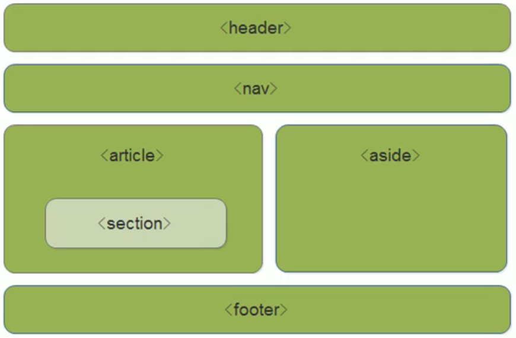

# HTML5笔记

---

**W3School的html5教程**：https://www.w3school.com.cn/html5/index.asp

**MDN的HTML5教程**：https://developer.mozilla.org/zh-CN/docs/Web/Guide/HTML/HTML5

## HTML5浏览器支持

最新版的Safari，Chrome，Firefox以及Opera支持某些html5特性。IE 9及以上将支持某些html5特性。

## html5的新特性

> * 用于绘画的canvas元素。
> * 用于媒介回放的video和aduio元素。
> * 新增的特殊内容元素。例如：article，footer，header，nav，section。
> * 新增的表单控件。例如：calendar，date，time，email，url，search。
> * 对本地离线存储更好的支持。

---

## HTML5新增的语义化标签

| 标签            | 描述       |
| --------------- | ---------- |
| &lt;header&gt;  | 头部标签   |
| &lt;nav&gt;     | 导航标签   |
| &lt;article&gt; | 内容标签   |
| &lt;section&gt; | 块级标签   |
| &lt;aside&gt;   | 侧边栏标签 |
| &lt;footer&gt;  | 尾部标签   |



> * 语义化标准主要是针对搜索引擎的。
> * 这些新标签在页面中都可以多次使用。
> * 在IE 9中需要将这些元素转换成块级元素。
> * 移动端更习惯使用这些标签。

---

## html5新增的多媒体标签

| 标签          | 描述     |
| ------------- | -------- |
| &lt;audio&gt; | 音频标签 |
| &lt;video&gt; | 视频标签 |

### &lt;audio&gt;音频 标签 

在页面中插入音频，但是只支持三种音频格式。

| 格式 | IE 9 | Firefox 3.5 | Opera 10.5 | Chrome 3.0 | Safari 3.0 |
| ---- | ---- | ----------- | ---------- | ---------- | ---------- |
| Ogg  |      | 支持        | 支持       | 支持       |            |
| MP3  | 支持 |             |            | 支持       | 支持       |
| Wav  |      | 支持        | 支持       |            | 支持       |

**&lt;audio&gt;音频标签属性**

| 属性     | 值       | 描述                                                         |
| -------- | -------- | ------------------------------------------------------------ |
| autoplay | autoplay | 如果出现该属性，则音频在就绪后马上播放（==自动播放==）       |
| controls | controls | 如果出现该属性，则向用户显示控件，比如播放按钮               |
| loop     | loop     | 如果出现该属性，则每当音频结束时重新开始播放（==循环播放==） |
| preload  | preload  | 如果出现该属性，则音频在页面加载时进行加载，并预备播放。如果使用 "autoplay"，则忽略该属性 |
| src      | url      | 要播放的音频的 URL                                           |

&lt;audio&gt;元素允许多个&lt;source&gt;元素。&lt;source&gt;元素可以链接不同的音频文件。因此可以解决兼容性问题。

例：

```html
<audio controls="controls">
  <source src="song.ogg" type="audio/ogg">
  <source src="song.mp3" type="audio/mpeg">
Your browser does not support the audio tag.
</audio>
```

### &lt;video&gt;视频标签

在页面中插入视频，但是支持三种视频格式。

| 格式   | IE   | Firefox | Opera | Chrome | Safari |
| ------ | ---- | ------- | ----- | ------ | ------ |
| Ogg    | No   | 3.5+    | 10.5+ | 5.0+   | No     |
| MPGE 4 | 9.0+ | No      | No    | 5.0+   | 3.0+   |
| WebM   | No   | 4.0+    | 10.6+ | 6.0+   | No     |

**&lt;video&gt;视频标签属性**

| 属性     | 值       | 描述                                                         |
| -------- | -------- | ------------------------------------------------------------ |
| autoplay | autoplay | 如果出现该属性，则视频在就绪后马上播放。                     |
| controls | controls | 如果出现该属性，则向用户显示控件，比如播放按钮。             |
| loop     | loop     | 如果出现该属性，则当媒介文件完成播放后再次开始播放。         |
| preload  | preload  | 如果出现该属性，则视频在页面加载时进行加载，并预备播放。如果使用 "autoplay"，则忽略该属性。 |
| src      | url      | 要播放的视频的 URL。                                         |
| height   | pixels   | 设置视频播放器的高度。                                       |
| width    | pixels   | 设置视频播放器的宽度。                                       |

---

## html5新增的表单，表单属性

