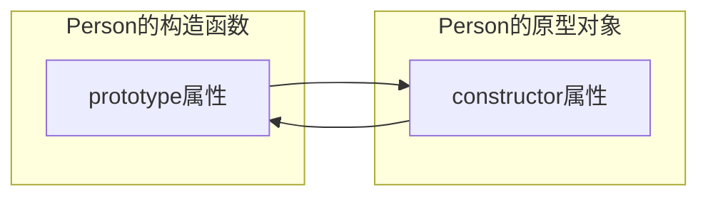
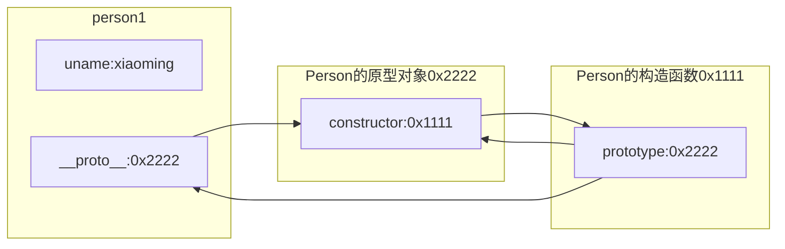

# 面向对象(object-oriented)

对象使用属性和方法组成的。

对象的属性使用变量来描述。

对象的方法使用函数来描述。

#### 类与对象的关系

类是对象的集合。

对象是类的实例化。

## 构造函数

构造函数名一般首字母大写。

使用`function`关键字定义一个构造函数。

`javascript`中没有类`class`的概念，主要是通过构造函数来模拟。

```javascript
function <构造函数名>() {
  // 函数体
}
```


ps : 一般不在构造函数内定义方法，因为每实例化一个对象，都会在内存中开辟一个新地址，因此对象的方法是重复的。

## 对象实例化原理

实例化对象并不是直接将数据保存在变量中，而是先在堆内存中开辟一个新空间，把这个空间的引用保存在变量中。

```
栈内存               堆内存
student = 0x1111 -> 0x1111(uname: "xiaoming", age: 18)
```

创建`Student`构造函数和实例化`Student`。

```javascript
function Student(n, a) {
  this.uname = n;
  this.age = a;
}

var student = new Student("xiaoming", 18);
```

## 原型

原型的产生只要是为了解决方法共享的问题。

系统在创建构造函数的同时，会自动在内存中生成一个与之相应的对象，这个对象就是`原型对象`。

`构造函数`与`原型对象`是两个独立的内存空间。


系统在创建`Person`构造函数的同时，自动在内存中生成一个与之对应的`Person`原型对象。

```javascript
function Person() {}
```



在`Person`的构造函数中存在一个prototype属性指向`Person`的原型对象。

在`Person`的原型对象中存在一个constructor属性指向`Person`的构造函数。


```javascript
function Person(n) {
  this.uname = n;
}

var person = new Person("xiaoming");

console.log(Person.prototype === person.__proto__); // true
```

实例化出来的对象都会存在一个`__proto__`(隐式原型)属性，指向原型对象。

`prototype`是构造函数的属性; `__proto__`是实例化对象的属性。

构造函数的`prototype`属性和实例化对象的`__proto__`属性指向同一个对象。



## 使用原型定义方法

```javascript
// 1. 在构造函数中定义属性
function Student(n, a) {
  this.uname = n;
  this.age = a;
}

// 2. 在原型中定义方法
Student.prototype.sayHi() {
  console.log("hello");
}

// 3. 实例化对象
var stu = new Student("xiaoming", 18);
var stu1 = new Student("xiaomei", 19);

// 4. 比较不同对象的方法是否相同
console.log(stu.sayHi === stu1.sayHi); // true
```

## this关键字

<++>
