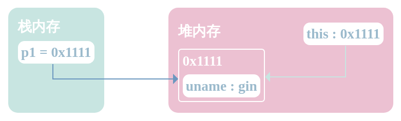

# 原型与原型链

`JavaScript`是通过`构造函数`来模拟`类`。

## 对象实例化的过程

```javascript
function Person(uname) {
  this.uname = uname;
}
var p1 = new Person("gin");
```

1. 在堆内存中开辟一个空间。假设开辟空间的地址为：`0x1111`。

---


2. this指向该空间。`this`指向`0x1111`。

---


3. 执行函数体。在开辟的空间中保存数据。代码执行到`this.uname = uname`，将`gin`保存在对象中。

---


4. 返回内存空间的首地址。返回内存首地址`0x1111`，变量`p1`保存返回的堆内存地址`0x1111`。

---



## 在构造函数定义方法存在的问题

```javascript
function Person(uname) {
  this.uname = uname;
  this.run = function () {
    console.log(this.uname + " is runnig");
  };
}
var p1 = new Person("p1");
var p2 = new Person("p2");

console.log(p1.run === p2.run); // false
```

以上代码通过`Person`构造函数`实例化`了两个对象：`p1`和`p2`。

而比较`p1`和`p2`中`run`方法的内存地址结果为`false`，说明`p1`和`p2`中`run`方法的内存地址不同。


