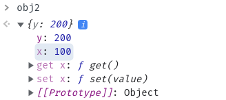
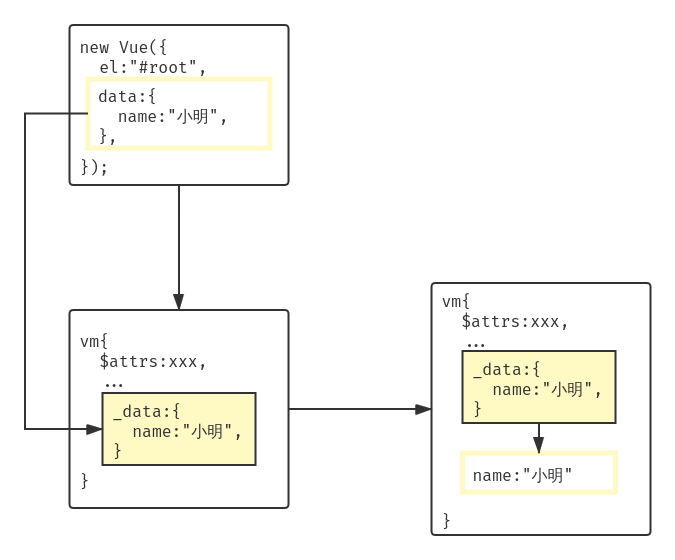

# 数据代理

## Object.defineProperty方法

### Object.defineProperty方法的参数

---

第一个参数：需要添加属性的对象。

第二个参数：添加的属性。

第三个参数：配置对象。

#### 配置对象的属性

---

| 属性         | 属性值                                  |
|--------------|-----------------------------------------|
| value        | 添加的属性的属性值                      |
| enumberable  | 控制属性是否可以枚举，默认值为`false`   |
| writable     | 控制属性是否可以被修改，默认值为`false` |
| configurable | 控制属性是否可以被删除，默认值是`false` |

#### 配置对象的方法

---

| 方法       | 描述                                                                  |
|------------|-----------------------------------------------------------------------|
| get()      | 每当读取新添加的属性时，get函数就会被调用，且返回值是新添加的属性的值 |
| set(value) | 每当修改新添加的属性时，set函数就会被调用，且会收到修改的具体值       |


```javascript
let person = {
  name:'小明',
  sex:'男',
}

Object.defineProperty(person,'age',{
  value:18,
})
```

## 数据代理

通过一个对象代理对另一个对象中的属性的操作。

以下代码通过`obj2`对象操作`obj1`对象中的数据。

```javascript
let obj1={x:100};
let obj2={y:200};

Object.defineProperty(obj2,'x',{
  get(){
    return obj1.x;
  },
  set(value){
    obj1.x = value;
  }
})
```




### vue 中的数据代理

---

通过`vm`对象代理`data`对象中的属性的操作。

#### 基本原理

---

```
1. 通过Object.defineProperty()方法把data对象中的所有属性添加到vm对象上。

2. 为每一个添加到vm对象上的属性，都指定一个getter/setter。

3. 在getter/setter内部去操作data对象中对应的属性。
```




