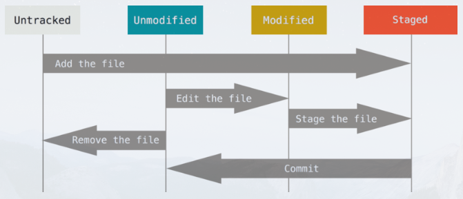

# git

## 三种状态

git有三种状态，文件可能处于其中一种：**已提交(committed)**，**已修改(modified)**和**已暂存(staged)**

```
1. 已修改表示修改了文件，但是还没有保存到数据库中

2. 已暂存表示对一个已修改文件的当前版本做了标记，使之包含在下次提交的快照中

3. 已提交表示数据已经安全地保存在本地数据库中
```

这会让git项目拥有3个阶段：**工作区**，**暂存区**，**git目录**


工作区是对项目的某个版本独立提取出来的内容。这些从git仓库的压缩数据库中提取出来的文件，放在磁盘上提供使用和修改

暂存区是一个文件，保存了下一次将要提交的文件列表信息，一般在git仓库目录中。

git仓库目录是git用来保存项目数据和对象数据库的地方。这是git中最重要的部分，从其他计算机克隆仓库时，复制的就是这里的数据

基本的git工作流程：

```
1. 在工作区中修改文件

2. 将想要下次提交的更改选择性地暂存，这样只会将更改的部分添加到暂存区

3. 更新提交，找到暂存区的文件，将快照永久性存储到git目录
```

## 初次运行git前的配置

每台计算机只需要配置一次，程序升级时会保留配置信息，可以在任何时候通过命令来修改配置信息

git自带一个git config的工具来帮助设置控制git外观和行为的配置变量。这些变量存储在3个不同的位置：

```
1. /etc/gitconfig文件：包含系统上每一个用户及他们仓库的通用配置。 如果在执行 git config 时带上 --system 选项，那么它就会读写该文件中的配置变量。 （由于它是系统配置文件，因此你需要管理员或超级用户权限来修改它。）

2. ~/.gitconfig 或 ~/.config/git/config 文件：只针对当前用户。 你可以传递 --global 选项让 Git 读写此文件，这会对你系统上 所有 的仓库生效。

3. 当前使用仓库的 Git 目录中的 config 文件（即 .git/config）：针对该仓库。 你可以传递 --local 选项让 Git 强制读写此文件，虽然默认情况下用的就是它。。 （当然，你需要进入某个 Git 仓库中才能让该选项生效。）
```

### 用户信息

设置用户信息(用户名和邮箱)。

这一点非常重要，因为每一个git提交都会使用这些信息，这些信息会写入每一次的提交中，不可更改：

```
git config --global user.name <"username">

git config --global user.email <email address>
```

使用了--global选项，那么该命令只需要运行一次。如果需要在特定项目使用不同的用户名和邮箱，可以在那个项目目录下运行没有--global选项的命令来配置

### 文本编辑器

配置默认的文本编辑器，当git需要输入信息时会调用文本编辑器。如果未配置，git会使用系统默认的编辑器

```
 git config --global core.editor vim(编辑器名称)
```

### 检查配置信息

```
git config --list
```

可以通过输入git config <key>来检查某一项配置

```
查看用户名

git config <user.name>
```

## 获取帮助

```
git help <verb>
```

## 获取git仓库

通常有2种获取git项目仓库的方式：

```
1. 将尚未进行版本控制的本地项目转换成git仓库

2. 从其他服务器克隆一个已经存在的git仓库
```

### 创建git本地库

将当前目录创建为git本地库

```
git init
```

该命令将创建一个名为.git的子目录，这个子目录含有初始化的git仓库中所有的必须文件。虽然创建了本地库，但是项目的文件还没有被跟踪

### 克隆现有的仓库

```
git clone <url>
```

## 记录每次更新到仓库

工作目录下的每个文件都不外乎2种状态：**已跟踪**或**未跟踪**

已跟踪的文件是指被纳入了版本控制的文件。简而言之，已跟踪而文件就是git已经知道的文件

工作目录中除了已跟踪的文件，其他的都是未跟踪的文件

编辑过某些文件之后，由于自上次提交后对文件进行了修改，git将他们标记为已修改的文件。在工作时，可以选择性地将这些修改过的文件添加到暂存区中，然后提交所有已暂存的修改，如此反复



### 跟踪新文件

使用"git add"命令开始跟踪一个文件

```
git add .

git add <file name>
```

"."表示将本地库中的所以文件都放入暂存区中。add后面也可以跟文件名，表示将该文件放入暂存区

每次对文件进行修改需要使用git add <文件>将新的改动添加到暂存区

### 检查当前文件状态

可以用git status命令查看哪些文件处于什么状态

git status命令的输出十分详细，使用"git status -s"命令或"git status --short"命令可以得到一个格式更加紧凑的输出

```
git status -s
```

新添加的未跟踪文件前面有"??"标记，新添加到暂存区中的文件前面有"A"标记，修改过的文件前面有"M"标记

### 忽略文件

如果希望跟踪某些文件，比如编译过程中产生的临时文件。可以创建一个名为".gitignore"的文件，列出要忽略的文件

要养成一开始就为新仓库设置好".gitignore"文件的好习惯，以免将来误提交一些无用的文件

".gitignore"文件的格式规范如下：

```
1. 所有空行或以#开头的行都会被git忽略

2. 可以使用标准的glob模式匹配，他会递归地应用在整个工作区

3. 匹配模式可以以"/"开头防止递归

4. 匹配模式可以以"/"结尾指定目录

5. 要忽略指定模式以外的文件或目录，可以在模式前加"!"取反
```

所谓的glob模式指的是shell所使用的简化的正则表达式。

**Tip**：GitHub有一个十分详细的针对数十种项目及语言的".gitignore"文件列表，其地址如下

github地址：https://github.com/github/gitignore

### 查看已暂存和未暂存的修改

如果想要知道具体修改了什么地方，可以使用"git diff"命令查看具体的修改。

如果需要查看已暂存的将要添加到下一次提交的内容，可以用"git diff --staged"命令。这条命令将比对已暂存的文件和最后一次提交的文件的差异

```
git diff --staged
```

使用"git diff --cached"命令可以查看已经暂存起来的变化

```
git diff --cached
```

### 提交更新

在提交此前，请务必确认还有什么已修改或新建的文件还没有"git add"过的。否则提交的时候不会记录这些尚未暂存的修改

所以，每次准备提交前，先使用"git status"查看所需要的文件是否都已经暂存了，然后在使用提交命令"git commit"

```
git commit
```

这样会启动文本编辑器来输入提交说明

使用"git commit -a"命令可以跳过暂存，需要注意的是这可能会将一些不需要的文件添加到提交中

## submodule

添加子模块

```sh
git submodule add <url_to_submodule> <path_to_submodule>
```

更新子模块

```sh
git submodule update --remote --merge
```

删除子模块

1. 删除子模块的配置信息

```sh
git submodule deinit -f <path_to_submodule>
```

2. 从父仓库中删除子模块的引用

```sh
git rm -f <path_to_submodule>
```

3. 删除子模块文件

```sh
rm -rf .git/modules/<path_to_submodule>
```

## github生成toc

```sh
wget https://raw.githubusercontent.com/ekalinin/github-markdown-toc/master/gh-md-toc

chmod a+x gh-md-toc

./gh-md-toc <file>
```

## GitHub Flow

两个分支: `main` 和 `feature`。
