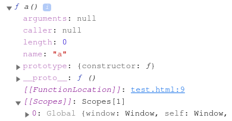
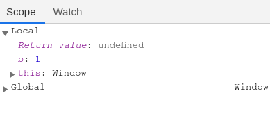
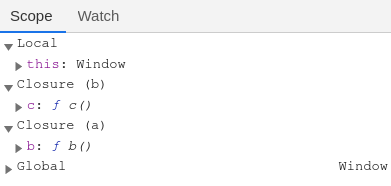

# 作用域与作用域链

## 作用域

`作用域`指的是变量存在的范围。

在`ES6`之前只有2种作用域：`全局作用域`，`函数作用域`。

ES6新增`块级作用域`。

### 全局作用域

---

由`<script>`标签产生的区域，可以理解为`GO对象`。变量在整个程序中一直存在，所有地方都可以读取。

### 函数作用域

---

`函数作用域`：由函数产生的区域，可以理解为`AO对象`。变量只在函数内部存在。

## 作用域链

### [[scopes]]属性

---

`[[scopes]]`属性保存的是`包含该函数执行环境`的`作用域链`。

### 函数声明时的作用域链

---

每个函数`声明`时都会为该函数添加一个`[[scopes]]`属性。

```javascript
function a() {}

console.dir(a);
```



由上图可以看出，`函数a`未调用时，打印`函数a`的内部结构。`函数a`的`[[scopes]]`属性中只保存了`Global`，即`window`对象.

### 函数调用时的作用域链

---

`函数a`被调用时，创建`函数a`的`AO对象`，并把`函数a`的`AO对象`压入`执行栈`中。

```javascript
function a() {
  var b = 1;
}
a();
```




由上图可以看出，当`函数a`被调用时，当前的作用域为`函数a`的`AO对象`，并处于`作用域链`的最前端。


由上图可以看出，当`函数a`执行结束后，`函数a`的`AO对象`就会被销毁，此时`作用域链`的最前端为`window对象`。

### 例

---

```javascript
function a() {
  console.dir(a);
  function b() {
    console.dir(b);
    function c() {
      console.dir(c);
    }
    c();
  }
  b();
}
a();
```

代码的执行过程中`[[scopes]]`的情况：

```
1. 全局环境，产生GO对象。
   scopes:
        0: GO对象
2. 代码执行到a()，产生函数a的AO对象，将函数a的AO对象压入执行栈。此时作用域链的最前端为函数a的AO对象。
   scopes:
        0: 函数a的AO对象
        1: GO对象
3. 代码执行到b()，产生函数b的AO对象，将函数b的AO对象压入执行栈。此时作用域链的最前端为函数b的AO对象。
   scopes:
        0: 函数b的AO对象
        1：函数a的AO对象
        2：GO对象
4. 代码执行到c()，产生函数c的AO对象，将函数c的AO对象压入执行栈。此时作用域链的最前端为函数c的AO对象。
   scopes:
        0: 函数c的AO对象
        1: 函数b的AO对象
        2: 函数a的AO对象
        3: GO对象
```



( `函数c的AO对象` --> `函数b的AO对象` --> `函数a的AO对象` --> `GO对象` )就是一条完整`作用域链`。

### 作用域链的作用

---

内部函数可以使用外部函数声明的变量。

函数要访问一个变量首先会在自身的作用域中查找，如果自身的作用域没有该变量，则会在作用域链上依次向上查找该变量。

```javascript
var num_a = 1;
function a() {
  function b() {
    var num_b = 2;
    console.log(num_b); // 2
    function c() {
      console.log(num_a); // 1
    }
    c();
  }
  b();
}
a();
```

#### 代码打印语句的执行情况

1. 在执行`console.log(num_b)`时，首先会在`函数b`的`AO对象`中查找`num_b`变量。在`函数b`的`AO对象`中存在`num_b`变量，所以打印结果为2。

2. 在执行`console.log(num_a)`时，首先会在`函数c`的`AO对象`中查找`num_a`变量。在`函数c`的`AO对象`中不存在`num_a`变量。此时，就会在作用域链上依次向上查找`num_a`变量。离`函数c`的`AO对象`最近的作用域为`函数b`的`AO对象`。`函数b`的`AO对象`仍然没有`num_a`变量。则会在作用域链继续查找`num_a`变量。知道在`GO对象`中找到`num_a`变量，所以打印结果为1。


