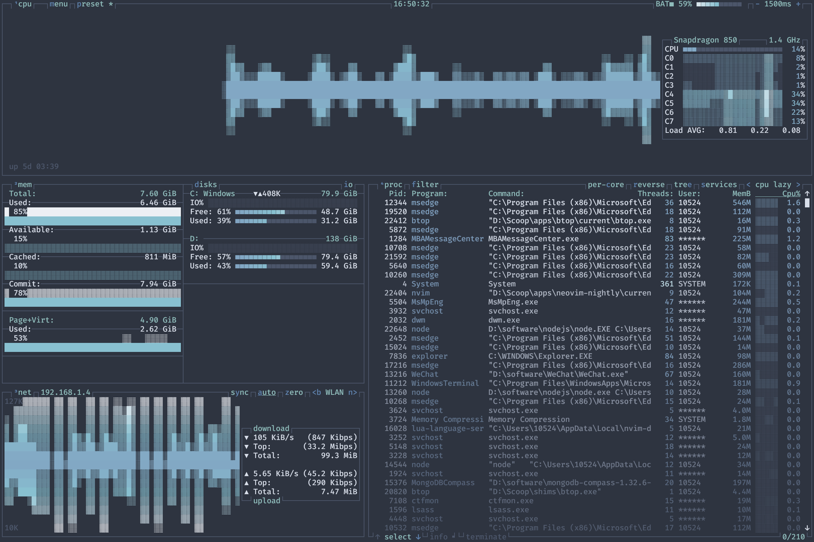
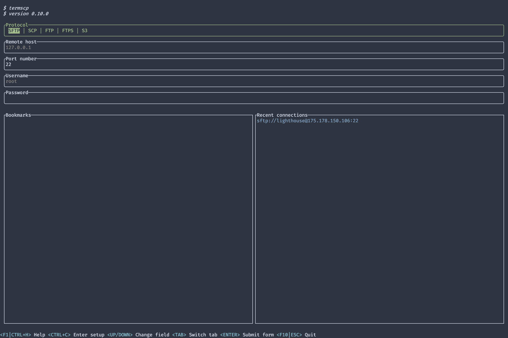
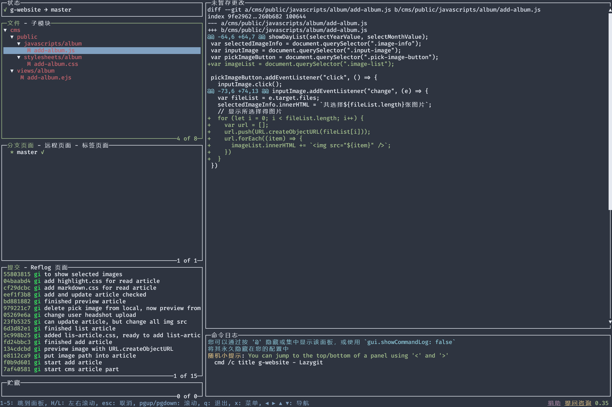

# Windows 下可用的 TUI 工具

---

[TOC]

## 编辑器 - neovim

---

GitHub 地址：[neovim/neovim](https://github.com/neovim/neovim)

个人配置地址：[GIN-18/nvim](https://github.com/GIN-18/nvim) 


### 安装 neovim

---

在 `powershell` 中：

```powershell
scoop install neovim
```

## 文件管理 - lf

---

GitHub 地址：[gokcehan/lf](https://github.com/gokcehan/lf)


### 安装 lf

---

依赖：[Go](https://go.dev/)

在 `cmd` 中 (Go version < 1.17)：

```cmd
set CGO_ENABLED=0
set GO111MODULE=on
go get -u -ldflags="-s -w" github.com/gokcehan/lf
```

在 `cmd` 中 (Go version >= 1.17)：

```cmd
set CGO_ENABLED=0
go install -ldflags="-s -w" github.com/gokcehan/lf@latest
```

在 `powershell` 中 (Go version < 1.17)：

```powershell
$env:CGO_ENABLED = '0'
$env:GO111MODULE = 'on'
go get -u -ldflags="-s -w" github.com/gokcehan/lf
```

在 `powershell` 中 (Go version >= 1.17)：

```powershell
$env:CGO_ENABLED = '0'
go install -ldflags="-s -w" github.com/gokcehan/lf@latest
```

## 任务管理 - btop

---

GitHub 地址：[aristocratos/btop](https://github.com/aristocratos/btop)



### 安装 btop

---

在 `powershell` 中：

```powershell
scoop install btop
```

## 文件传输 - termscp

---

GitHub 地址：[veeso/termscp](https://github.com/veeso/termscp) 



### 安装 termscp

---

在 `powershell` 中：

```powershell
scoop install termscp
```

## git - lazygit

---

GitHub 地址：[jesseduffield/lazygit](https://github.com/jesseduffield/lazygit)



### 安装 lazygit

---

依赖：[Git](https://git-scm.com/)

在 `powershell` 中：

```powershell
scoop bucket add extras

scoop install lazygit
```


